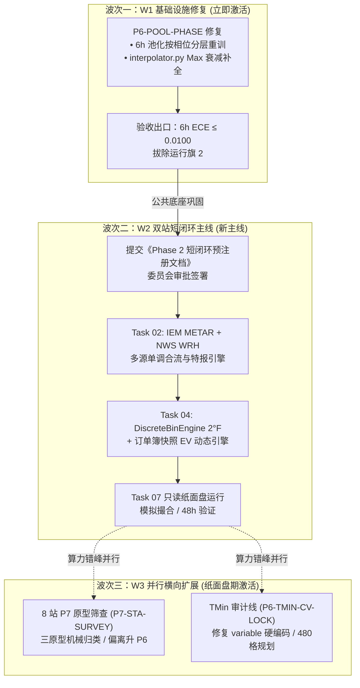

# 项目长线规划法定文档 (docs/ROADMAP.md)

> **法定定位**：本项目战略规划最高生效准绳与路线图  
> **生效日期**：2026-10-10  
> **立项依据**：工单 `P7-TRANSITION-DOC` 及技术裁决委员会立项会终裁  
> **当前阶段**：Phase 7 过渡态（主线战略转向：由“横向扩展”全面转向“纵向落地”）  

---

## §1 战略转向裁决（P7 立项会决议存档）

2026-10-10 技术裁决委员会立项会正式听取并全票通过工单 `P6-STATUS-FORENSIC`《全库状态盘点呈报》。委员会做出战略转向终局裁决：

1. **盘点验收与 P6 封卷确认**：全库状态盘点通过终审验收，Phase 6 阶段（双城 TMax 24 时间格/96 季节格验证与方法论封盘）正式封卷，GitHub 主干基线严格锁定于 `6fe386c`；
2. **战略转向核心指令**：项目主线正式由“横向扩展”（盲目推进剩余 8 站与 480 格 TMin 离线交叉验证）全面转向**“纵向落地”**（连接 Polymarket 盘口，跑通物理概率向交易订单的端到端闭环）；
3. **裁决核心事实依据**：
   - **气象模型侧**：KORD 与 KMIA 双站 TMax 24 格（96 季节格）已打下极高精度的物理与统计地基（20 折 Block-CV 独立选型、两段式 BIC 竞争、EVT Scheme B 条件高斯截断、昼夜谐波机制外推、池化 6h 审计全量通过），资产可靠度达标率 100%；
   - **交易工程侧**：对比《项目方案 v2.7》与《Phase 2 执行文件 v2.0》的最初承诺，整个 Phase 2 交易引擎（实况多源单调合流、特报截断、异常仲裁、离散 EV 映射、资金凯利、IOC 订单路由、纸面盘模拟）**完成度为 0.0%**；
   - **核心矛盾**：在未连接盘口与订单簿的情况下，继续投入庞大算力审计新气象格无法产生任何金融价值与现金流反馈。必须立即启动**三波次路线图**，推动物理概率资产向实际盘口套利转化。

---

## §2 决策逻辑链（为什么这么排）

为保证后续会话中的技术人员与代理人能够无损重建推导过程，本节完整记录委员会决策逻辑链条：

1. **对账事实层发现**：
   - **资产层零盲站**：全美核心 Active 10 台站（`KATL, KAUS, KDAL, KHOU, KLAX, KLGA, KMIA, KORD, KSEA, KSFO`）的原始气象观测历史全部达到 78.55~96.72 年（远超 $\ge 30$ 年口径 A 门槛），2000–2019 训练集 100% 齐备，磁盘均已持有 96 套模型 `.pkl`（960 模型全矩阵在库）；
   - **审计层大面积空白**：全网格 960 格模型中，真正完成 20 折 Block-CV 独立选型与严格可靠度审计的仅有 KORD 与 KMIA 的 TMax（24/120 提前期格，即 2/10 站）；其余 8 站 TMax 覆盖率为 0%，全量 10 站 TMin（480 格）因历史脚本硬编码 `variable="tmax"` 导致审计覆盖率严格为 0%；
   - **交易工程层完全停滞**：交易宇宙虽固化，但盘口接入模块尚未动工。
2. **系统断层定性**：
   - 当前项目呈现“金矿精装修但没修路”的结构性断层。若机械推进剩余 8 站与 TMin 的全量 Block-CV，将耗费数周时间深陷于气象边界细节与离线门禁，而无法验证系统在 Polymarket 盘口上的实际盈利与套利有效性。
3. **波次一 (W1) 列首的理由（先后成本差与资产解绑）**：
   - 现役 80 套 6h 池化回退模型经 `P6-POOL6H-AUDIT` 取证，在晨谷时刻存在方差膨胀（KMIA ECE = 0.019657 越线），且 `interpolator.py` Max Temp 缺失开方方差衰减公式，当前挂有两条运行旗（`FLAGGED_POOL_PHASE_ISSUE` 与 `COMPLETED_ECE_FLAGGED` 触发器 1/2）；
   - **成本差效应**：池化回退层与插值衰减代码是全库所有站点共享的公共基础设施。**先修后扩，则后续 8 站与 TMin 将天然继承正确模板；若先扩后修，未来所有新增站点均需二次返工重算**。故 W1 必须绝对列首先行。
4. **波次二 (W2) 范围收窄的理由（风险后移与工程聚焦）**：
   - 为极速打通金融闭环，将原定 Phase 2 庞大的 Task 01~07 全套架构进行战术收窄：
   - **纸面盘降级为只读观测模式**：仅进行离散概率映射、实时订单簿对账与模拟成交撮合，**不接触账户私钥、不发起真实鏈上交易**；
   - **风险模块整体后移**：原定 Task 03（异常仲裁与拔网线）、Task 05（四桶资金凯利）、Task 06（IOC 订单路由与残局状态机）整体顺延至实盘前置阶段（`DEFERRED_TO_PRE_LIVE`）；
   - **工程面极度聚焦**：W2 仅需攻坚 Task 02（实况单调合流与特报截断）与 Task 04（2°F 离散映射与动态 EV 引擎），在 KORD / KMIA 双站上以最小代价跑通只读正期望值套利链路。
5. **波次三 (W3) 纸面盘期间并行的理由（算力错峰与零冲突）**：
   - W2 纸面盘只读运行期需要连续观察（至少 48 小时起步，目标 2 周），在此期间交易端算力需求极低；
   - W3 包含的 8 站轻量原型筛查与 TMin 审计纯属离线只读数据计算，与线上交易数据流完全物理隔离、零资源冲突，实现项目周期最优压缩。

---

## §3 三波次路线图（执行框架）

### 3.1 W1 —— P6-POOL-PHASE 修复（立即激活）
- **核心范围**：
  1. 依据预注册条款原文：现役 80 套 6h 池化回退模型按验证时刻昼夜相位（晨谷簇 00:00–08:00 LT vs 峰顶簇 13:00–20:00 LT）进行分层重训与方差校准；
  2. 修复 `src/modeling/interpolator.py`：系统补全 Max Temp 短时效 $\sigma_L = \sigma_{24\text{h}} \cdot \sqrt{\max(0, L)/24.0}$ 物理方差衰减公式，消解边界平底截断缺口。
- **性质质变声明**：**本工单为 P6 封盘后首个生产代码工单**，纪律正式升格为“**编辑须令、测试护航、门禁复验**”；
- **验收出口**：修复后 6h 回退层交易窗口加权 ECE $\le 0.0100$（重点攻坚 KMIA 晨谷窗达到 PASS），达标后经委员会终裁正式拔除【运行旗 2】（`FLAGGED_POOL_PHASE_ISSUE`）；
- **当前状态标注**：`ACTIVATED_W1_PLANNED`。工单全文待委员会下发，**本文档仅落档目标与范围，不构成生产代码开工令**；
- **开工前置条件清单**：新会话向技术裁决委员会请示 $\to$ 委员会下发 W1 正式执行工单（含预注册判据与测试要求）$\to$ 方可编写第一行生产代码。

### 3.2 W2 —— Phase 2 双站短闭环（新主线）
- **先锋阵容**：KORD（芝加哥奥黑尔）与 KMIA（迈阿密国际机场）双站，直接入役 P6 封卷之 24 时间格/96 季节格 TMax 资产；
- **执行顺序**：
  1. **Task 02（实况多源单调合流与特报引擎）**：对接 IEM METAR 与 NWS WRH 观测流，实现单调递增合流、SPECI 纯温高频截断、迟到不投丢弃器；
  2. **Task 04（离散概率映射与动态 EV 引擎）**：挂接成熟的 `DiscreteBinEngine`，连续 $F(y)$ 解析积分映射为 Polymarket 2°F 阶梯档位，扣除费率生成双边正 EV 报价；
  3. **合成只读纸面链路**：跑通“物理概率 $\to$ 离散积分 $\to$ 订单簿快照 $\to$ 净 EV 信号 $\to$ 虚拟撮合流水”。
- **预注册前置（硬条款）**：在动手编写任何 Phase 2 生产代码前，agent 必须先向委员会呈报《Phase 2 短闭环预注册规格书》（明确范围、接口契约、单测基线扩充方案与验收判据），经委员会正式签署批准后方可开跑；
- **顺延与重定义状态**：
  - `Task 03 / 05 / 06`：置为 **`DEFERRED_TO_PRE_LIVE`**（顺延至实盘前置阶段）；
  - `Task 07`：置为 **`REDEFINED_READ_ONLY`**（重定义为只读纸面盘观测模式，零真实资金、零私钥接触）。

### 3.3 W3 —— 并行横向扩展（纸面盘运行期激活）
- **依赖声明**：W3 开工时间不得早于 W2 纸面盘只读观测模式平稳启动运行；
- **8 站 P7 原型筛查 (`P7-STA-SURVEY`)**：
  - 彻底摒弃逐格耗费两周的重复慢速取证，采用**轻量三原型机械归类**：
    1. **内陆温带正午峰度型**（以 KORD 为原型）；
    2. **副热带沿海对流负偏型**（以 KMIA 为原型）；
    3. **特殊物理偏离型**（强逆温海雾 KSFO/KLAX、阿巴拉契亚山麓冷池 KATL 等）。
  - 对 8 站提取 12 提前期矩全景、晨谷/峰顶残差相位分解与 PIT 方差三指标，凡严格吻合原型 1 或 2 者，直接套用已封盘的门禁规约批量入账；唯有落入原型 3 者，方升级开立单站专项 P6 级审计；
- **TMin 审计线 (`P6-TMIN-CV-LOCK`)**：
  - 解锁 `tests/unit/modeling/test_p4_block_cv_20fold.py` 中 `variable="tmax"` 的硬编码，完成参数化改造；
  - 编制 480 格 TMin 的 Block-CV 审计推进计划。

---

## §4 Backlog 映射与状态更新后全景

依据战略转向裁决，全库 Backlog 议题映射与状态变更如下：

| 议题代码 | 议题全称 | P6 封卷状态 | P7 规划状态 | 所属波次 / 去向 | 备注与约束说明 |
| :---: | :--- | :---: | :---: | :---: | :--- |
| **B1** | **`P6-POOL-PHASE`** | `REGISTERED` | **`ACTIVATED_W1_PLANNED`** | **波次一 (W1)** | 立即激活，列首攻坚。承接 6h 相位重训与 Max 衰减公式修复。 |
| **B2** | **`P6-CALM-OUTLIER`** | `REGISTERED` | **`REGISTERED`** | 独立排期 | 防删条款绝对维持。5 元组实证已冻结，待实盘前夕评估 Regime 切换。 |
| **B3** | **`P6-RESEARCH-NO-GATE-BIC`** | `REGISTERED` | **`REGISTERED`** | 远期研究 | 纯 BIC 去门控选型研究，维持排队。 |
| **B4** | **`P6-RESEARCH-DIURNAL-PHASE`** | `REGISTERED` | **`REGISTERED`** | 远期研究 | 验证时刻昼夜相位分层建模。其核心物理成果将在 W1 中获实证检验反哺。 |
| **B5** | **`P6-TMIN-CV-LOCK`** | — *(新增)* | **`REGISTERED`** | **波次三 (W3)** | 解除 CV 脚本 variable="tmax" 硬编码，规划 480 格 TMin 审计。 |
| **B6** | **`P7-STA-SURVEY`** | — *(新增)* | **`REGISTERED`** | **波次三 (W3)** | 8 站轻量三原型筛查方案。先冻结三指标判据，纸面盘期间并行跑数。 |

---

## §5 治理条款增补（生产代码时代纪律）

自 W1 启动起，项目正式由“只读取证时代”跨入“生产代码重构与落地时代”。本节条款为对既有《AGENTS.md》与《SYNC_POLICY.md》铁律的**法定增补条款**（非修改，原文继续绝对生效）：

1. **生产代码编辑法定授权制**：任何修改 `src/` 与 `scripts/` 的动作，必须严格凭载明修改范围、修改理由与明确验收判据的委员会工单令，严禁“顺手修复”、“无令重构”；
2. **全量自动化测试护航纪律**：任何代码提交或阶段交付前，必须全量执行测试套件（当前基线 987 项全绿），输出真实退出码与执行用时，确保零回归（0 failed）；
3. **模型层改动双重门禁复验**：凡涉及 EMOS 参数、分布族实现、插值器或约束截断层的修改，必须严格跑通零漂移门禁测试与覆盖率/ECE 复验，禁止仅凭单测放行；
4. **挂旗资产强制带旗引用**：
   - 🚩 `KMIA_12h`（`COMPLETED_ECE_FLAGGED`，加权 ECE = 0.0183 越线，触发器计数 1/2）；
   - 🚩 `6h 池化回退层`（`FLAGGED_POOL_PHASE_ISSUE`，加权 ECE = 0.019657 越线）；
   - 下游模块（包括 W2 的概率映射与 EV 引擎）在调用上述资产时，**必须在代码日志、配置与报告中显式带旗声明**，直到委员会下达正式拔旗裁决；
5. **预注册先行原则**：所有重大业务或算法开发（W1、W2），代码编写前必须先落盘预注册文档并获委员会批准。

---

## §6 与既有文档的关系声明

1. **权威解释位阶**：
   - 本文档与《项目方案 v2.7》保持战略一致；
   - 若本文档与《项目执行文件 v6.0》发生细节技术冲突，以《项目执行文件 v6.0》为准；
   - 若本文档与最高铁律《AGENTS.md》或《docs/SYNC_POLICY.md》发生冲突，以最高铁律为准；
2. **P6 封盘效力延续**：
   - 法定封盘报告 [`evidence/p6_tmax_methodology_closure.md`](../evidence/p6_tmax_methodology_closure.md) 及其已确立的事实层对账表、已知限制条款继续全面生效；
   - 本文档 §5 对 P6 挂旗资产实施无缝交叉继承。

---

## §7 版本记录

- **文档创建日期**：2026-10-10  
- **签发裁决**：技术裁决委员会立项会终裁令（2026-10-10）  
- **落档执行工单**：`P7-TRANSITION-DOC`（长线规划落档令）  
- **版本号**：v1.0.0 (Phase 7 初始法定长线规划)
