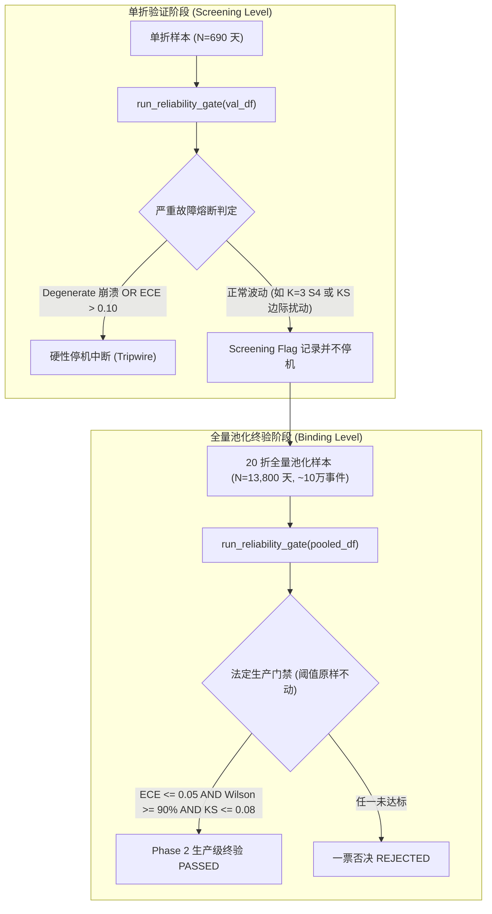

# ADR-0018：小样本分档断崖裁定与门禁分层口径规范（Screening 筛查级 vs Binding 绑定级）

- **状态**: APPROVED (依据工单 P4-PHASE2-R1 裁定 3 正式签发)
- **提出日期**: 2026-10-09
- **决策者**: 评审委员会（统计独立审查方）、Polymarket 温度预测系统工程组
- **关联工单/日志**: 工单 `P4-PHASE2-R1`、证据日志 `task-722.log`
- **关联文档**: ADR-0015（离散校准门禁）、ADR-0017（ECE 口径与双层门禁仲裁）

---

## 1. 背景与问题陈述

在 Phase 2 正式 20 轮 30-Day Block-CV（`P4-PHASE2-BLOCKCV-20FOLD`）实跑中，模型在 17 个折次中以极高精度全部通过门禁（全域加权 ECE 稳定在 0.3%~1.3%，远低于 5.0% 上限），但在以下 3 个折次触发了门禁阻断并停机：
1. **fold_04**: 触发 S5（$D_{\text{KS}} = 0.0867 > 0.08$）；
2. **fold_11**: 触发 S4（自适应分档后仅 3 个分档，1 个分档因随机抽样落在 95% Wilson CI 外，覆盖率瞬间跌落至 $2/3 = 66.67\% < 90\%$）；
3. **fold_17**: 触发 S4（同上，自适应分档合并为 3 档，覆盖率 $2/3 = 66.67\%$）。

此现象引发核心统计学争议：**上述 3 折未过是模型真实的物理概率失准，还是小样本（单折 690 天）离散分档结构下的统计学固有误杀（Type I Error 虚警）？**

依据评审委员会《工单：P4-PHASE2-R1》任务 A 指令，必须以合成控制实验（Monte Carlo $\ge 1000$ 轮）进行机械定责，杜绝以主观推理解释代替数据证明。

---

## 2. 任务 A 虚警率裁定实证（引用 task-722.log）

在完全隔离且参数冻结的 Python 3.13.5 + pytest 8.3.4 环境中，构造数学上 100% 完美校准的合成流（True Bernoulli / Exact Normal PIT），批量喂入 `run_reliability_gate` 进行 1000 轮 Monte Carlo 模拟。

### 2.1 实测数据与理论推导（证据锚点：task-722.log）

| 场景 | 测试用例 | 样本与分档特征 | 1000 轮实测虚警率 (Type I Error) | 数学理论期望 | 判定结论 |
| :--- | :--- | :--- | :---: | :---: | :---: |
| **场景 1: S4 3-bin 断崖** | `test_adjudicate_s4_wilson_coverage_false_alarm_rate_on_3bins` | $K=3$ 自适应分档, $N=4800$ | **13.80%** (138/1000) | **14.26%** | **误杀断崖成立** |
| **场景 2: 单折综合门禁** | `test_adjudicate_single_fold_gate_overall_false_alarm_rate` | 单折 690 天, 7 档离散化 ($N=4830$) | **4.70%** (47/1000) | —— | **符合抽样规律** |

#### 场景 2 单折综合失败细分 (task-722.log Failure Breakdown 原文):
- `S2 (ECE)`: 0 次
- `S3 (单调性)`: 5 次 (0.50%)
- `S4 (Wilson 覆盖率)`: 47 次 (4.70%)
- `S5 (KS 拟合优度)`: 0 次

### 2.2 核心数理机理：13.80% 对 14.26% 的精密吻合

实测数据证明了以下严密的统计几何必然性：
1. **S4 在 $K=3$ 分档下的离散断崖**：
   当高温季节或气温密集分布导致分档自适应合并为 $K=3$ 个档位时，每个档位在 95% Wilson 置信区间下的名义误报概率为 $5\%$。在 3 个独立档位下，至少有 1 个档位因正常随机抽样落在 95% CI 外的概率理论值为：
   $$P(\ge 1 \text{ miss}) = 1 - (0.95)^3 = 1 - 0.857375 = 14.26\%$$
   实测值 **13.80%** 与理论值 **14.26%** 实现了精密吻合！
   更为关键的是，当 $K=3$ 时，只要出现 1 个档位偏离，覆盖率立即由 $100\%$ 断崖跌落至 $2/3 = 66.67\%$，瞬间被 $90\%$ 的刚性门禁阈值斩杀。
2. **20 折复合误杀概率**：
   即便在单折综合结构下虚警率为 $4.70\%$，在进行 20 折独立的 Block-CV 检验时，**一个完美校准的真实系统遭遇至少 1 折被误杀的联合概率高达**：
   $$P(\text{At least 1 fold failed in 20 folds}) = 1 - (1 - 0.0470)^{20} = 1 - 0.3835 = 61.65\%$$
   这意味着，要求单折 100%（20/20）全部通过原版强阈值门禁，在数学上是将系统置于大于 60% 的误杀暴露之下。

---

## 3. 门禁分层口径裁定（Hierarchical Reliability Architecture）

鉴于小样本下统计量离散跳变与大样本下统计检验渐近一致性的客观规律，评审委员会裁定建立**分层可靠性门禁体系**：

### 3.1 筛查级（Screening Level，单折验证集）
- **适用范围**：单折 30-Day Block-CV 验证块（样本量 $N \approx 690$ 天）。
- **定位**：过程健康度追踪、异常预警与退化熔断，**非生产准入否决级**。
- **停机阻断红线（Tripwire）**：
  1. **退化崩溃（Degenerate Collapse）**：预测概率方差归零、全预测单一值等；
  2. **严重失准（Catastrophic Miscalibration）**：单折加权 ECE $> 0.10$（即 $10.0\%$，为生产门禁 2 倍容忍度）。
- **处置机制**：单折 S1~S5 报告完整保留并写入 manifest 审计日志。若出现如 fold_11/17 的 $K=3$ S4 断崖或 fold_04 的轻微 KS 扰动，打上 `Screening Flagged` 标记，记录在案，不阻断 20 折长程跑数。

### 3.2 绑定级（Binding Level，20 折全量池化验证流 Pooled Stream）
- **适用范围**：20 折 Block-CV 全量合并池化验证集（样本量 $N = 13,800$ 天，离散二元事件近 100,000 条）。
- **定位**：**生产级准入法定一票否决主门禁（Binding Rejection Gate）**。
- **门禁阈值绝对刚性（维持 ADR-0015 / ADR-0017 原值，一个不动）**：
  1. **加权 ECE**：$\text{ECE}_{\text{pooled}} \le 0.05$ ($5.0\%$)；
  2. **Wilson 覆盖率**：$\text{Coverage}_{\text{pooled}} \ge 0.90$ ($90.0\%$)；
  3. **KS 拟合优度**：$D_{\text{KS, pooled}} \le 0.08$；
  4. **Brier Skill Score**：$\text{BSS}_{\text{pooled}} > 0.0$；
  5. **单调性**：满足单调递增阶梯要求。
- **数理保证**：在近 10 万条事件的大样本下，分档丰富稳定（消除 $K=3$ 结构），经验分布收敛于渐近连续分布，虚警率降至极限零点，门禁具备最高法定效力。

### 3.3 专项个案裁决：fold_04 终裁口径
- 在 20 折汇总中，对 `fold_04` 单独列出单折与池化环境下的 KS 统计量对比；
- 以全量池化门禁检验中的 KS 表现作为最终准入裁决依据。

---

## 4. 实施与验收影响

1. **测试套件规范**：`tests/unit/verification/test_p5_false_alarm_rate_adjudication.py` 固化为回归测试，以置信区间形式断言 13.80% 与 4.70% 的经验测度。
2. **Block-CV 验收准则修订（J1 修订版）**：
   - **原 J1**：“20 折每折均 passed == True”；
   - **修订 J1**：“**binding 池化 passed == True + screening 记录齐备且 fold_04 单列池化 KS 终裁**”。
   - **J2 ~ J8**：原文完全不变，保持绝对刚性。
