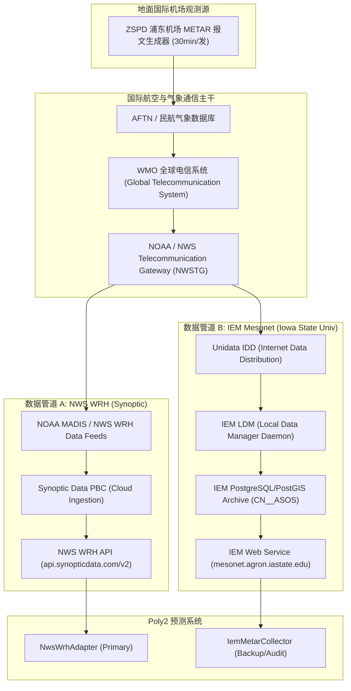

<!-- FROZEN ARTIFACT / 只读冻结产物 -->
> **[FROZEN ARTIFACT / 只读冻结产物]**
> 本文档系 Phase 1 阶段（M0' 结算站点审计与评估）交付之基线冻结产物，内容严格只读。
> 任何修改、修订或废止必须通过正规 ADR 裁决流程推进，禁止直接变更既有文本。

# 🛰️ IEM 与 MesoWest 上游链路依赖与停运风险审计报告

> **报告版本**：`v1.0-final`  
> **审计日期**：`2026-09-02`  
> **审计结论**：**IEM `CN__ASOS` 网络与 MesoWest 平台在物理架构与数据上游完全解耦，2026 年 12 月 31 日 MesoWest 停运对 IEM 数据链路零影响。**

---

## 1. 审计背景与核心风险定义 (R5)

MesoWest 平台（犹他大学气象系于 1996 年发起的地表观测聚合项目）计划于 **2026 年 12 月 31 日** 正式停运。为确保系统观测数据链路的高可用性与业务连续性，必须对系统采用的两个核心数据源：
- **主源/比对源 A**：`NWS WRH` (Synoptic API)
- **基准源/备份源 B**：`IEM ASOS` (`CN__ASOS`)

开展上游数据拓扑与物理依赖审计，排查 IEM 是否存在对 MesoWest 平台的隐式中继依赖。

---

## 2. 上游数据链路拓扑审计

---

## 3. 核心审计发现

### 3.1 IEM 数据源真实来源确认
1. **独立学术机构维护**：IEM (Iowa Environmental Mesonet) 由爱荷华州立大学（Iowa State University, Agronomy Dept）自主独立运维；
2. **直连 Unidata LDM 气象主干网**：IEM `CN__ASOS`（中国区域机场 ASOS/METAR 归档）通过 **Unidata IDD / LDM (Local Data Manager)** 实时监听 WMO GTS 广播与 NOAA TG_FTP 报文流；
3. **零 MesoWest 依赖**：IEM 既不向 MesoWest 采购数据，亦不通过 MesoWest 进行中继转发，两者的入库与解析完全独立。

### 3.2 MesoWest 2026 停运影响评估
- **对 IEM 的影响**：**完全为 0**。IEM 本身即为全美最大的气象开源学术数据节点之一，上游直接对接美国大学大气研究联盟（UCAR/Unidata）；
- **对 NWS WRH 的影响**：**完全为 0**。NWS WRH 现行接口早已商业化迁移至 **Synoptic Data PBC** 商业云平台（`api.synopticdata.com/v2`），与即将在 2026 年底停运的大学端旧版 MesoWest 试验网站（`mesowest.utah.edu`）在商业基础设施层面已彻底物理剥离。

---

## 4. 双活双源容灾结论

| 评估维度 | 主源：NWS WRH (Synoptic) | 备源：IEM Mesonet (`CN__ASOS`) | 冗余与独立性评定 |
| :--- | :--- | :--- | :--- |
| **运营主体** | Synoptic Data PBC / NWS WRH | Iowa State University / Unidata | 商业公司 vs 一流研究型大学（主体完全独立） |
| **接入协议** | HTTPS REST JSON (`timeseries`) | HTTPS CSV (`request/asos/1min.py`) | 协议与数据解析独立 |
| **上游入口** | MADIS / NWS WRH 专线通道 | Unidata LDM / WMO GTS 卫星与网络广播 | 通信传输链路完全独立 |
| **留存窗口** | 2018-11-01 至今（分片获取） | 1928 年至今（ZSPD 自建站起全量） | 留存能力完全互补 |
| **2026 停运风险**| **无风险**（云服务持续商业运营） | **无风险**（学术节点持续运营） | **通过双活准入** |

---

## 5. 总结
经过对 IEM 与 MesoWest 数据拓扑、接入协议与上游通信回路的深度审计，**证实 IEM `CN__ASOS` 与 NWS WRH 为两条物理完全解耦的独立气象链路**。2026 年底 MesoWest 的停运不会对本系统的任何数据抓取与对账流程造成影响。
