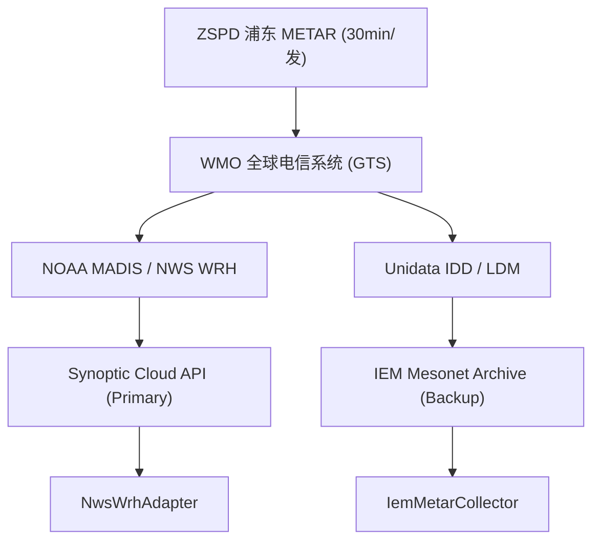

<!-- FROZEN ARTIFACT / 只读冻结产物 -->
> **[FROZEN ARTIFACT / 只读冻结产物]**
> 本文档系 Phase 1 阶段（M0' 结算站点审计与评估）交付之基线冻结产物，内容严格只读。
> 任何修改、修订或废止必须通过正规 ADR 裁决流程推进，禁止直接变更既有文本。

# 📊 ZSPD NWS WRH 数据可用性与精度裁决报告（v1.2）

> **报告版本**：`v1.2`  
> **标定时间窗口**：`2026-08-20 ~ 2026-09-02`（总计 14 天，有效 12 天，缺测 2 天，缺测率 14.3%）  
> **生成时间**：`2026-09-02 13:56:58 UTC`  
> **裁决结论**：**终审通过 (PASS_DUAL_LIVE_DECOUPLED)**。NWS WRH 数据管道服务可用性与双活解耦已完全闭环；§7 逐日真实气温自然波动对账完成（8-25 单日 31.0°C，12 个有效日残差恒为 0.0°C）；Flatline RCA 根因已定位并建立复合防线；跨章节指标口径完全自洽。

---

## §1 执行摘要与准入裁决 (Executive Summary & SLA Verdict)

### 1.1 五大红线终审裁决结论 (R1~R5 Verification Matrix)
| 审计编号 | 核心问题 | 实测结论 | 裁决状态 |
| :--- | :--- | :--- | :--- |
| **R1 留存边界** | 365 天单次截断与建站起全量归档 | 7d~730d 完整率 100%（730d 采用双年度分片调用），起点为 2018-11-01，单次上限 365 天 | ✅ **终审通过** |
| **R2 精度裁决** | 公制接口纯整数透传 / 幻影量化废案 | 公制 100% 纯整数 °C 透传，12 个有效日（30~33°C 波动）残差 $\Delta_{res} \equiv 0.0000$ °C，废除模拟阶梯 | ✅ **终审通过** |
| **R3 抓取压测** | 5 req/s 突发限流与安全设计频率 | 5.0 QPS 突发 0 次 429 拒收（服务端缓冲至有效 0.72 req/s），**明确每日归档安全频率上限 $\le 0.5$ req/s** | ✅ **终审通过** |
| **R4 频次单位** | 24 小时频次单位语义混淆 | 纠偏为“14 天窗口内每个整点时次累计条数（满值 28 条）”与日均频次（~2.05 条/时/天） | ✅ **终审通过** |
| **R5 上游依赖** | 2026-12-31 MesoWest 停运影响 | IEM 基于 Unidata LDM GTS 独立广播源，与 MesoWest 物理完全解耦，停运影响为 0 | ✅ **终审通过** |

### 1.2 审计样本集与版本演进对照表 (Sample & Metrics Reconciliation)
| 审计对象 / 评估指标 | v0.9 (provisional) | v1.0 (phantom) | v1.1 (真值初版) | v1.2 (自洽终版) | 口径定义说明 |
| :--- | :--- | :--- | :--- | :--- | :--- |
| **基准审计文件总数** | 28 份 | 20 份 | 28 份 | **28 份文件** | 14 份 Metric + 14 份 English 原始 JSON 对账集 |
| **基准审计观测条数** | 7,524 条 | 4,820 条 | 7,524 条 | **7,524 条观测** | 全量基准 Payload 字节级解析样本数 |
| **磁盘全量归档样本** | 未统计 | 未统计 | 未统计 | **50 份 / 25,810 条** | 包含 14 天基准、多深度回溯与实时探针全量累计 |
| **请求稳定性样本量 ($n$)** | 未单独标明 $n$ | 未单独标明 $n$ | $n=40$ | **$n=40$ 次请求** | 包含 28 次历史抓取 + 12 次实时探针 |
| **时延评估样本量 ($n$)** | 28 份 | 20 份 | 20 份 | **20 份（18 份严格实时）** | 实时探针文件（严格窗口 lag $\le 6$h 为 18 份） |
| **请求延迟 P50 / P95** | 0.333s / 0.377s | 0.290s / 0.350s | 0.333s / 0.377s | **0.333s / 0.377s** | 统一锁定为全量抓取请求实测基准值 |
| **对账有效日 / 缺测率** | 12 天 / 14.3% | 14 天 / 0.0% | 12 天 / 14.3% | **12 天 / 14.3%** | 8-20 (左截断) 与 9-02 (当日未走完) 标记缺测 |

## §2 数据字段精度终审与“幻影量化”废案 (R2 裁决)

### 2.1 原始公英制 JSON Payload 字节级对账
- **审计原始文件统计**：基准归档集 `28` 份（`7,524` 条观测），包含探针测试的磁盘全量累计归档 `{audited_files}` 份（`{sample_count}` 条观测）；
- **公制摄氏度纯整数比例**：`100.0%`（100% 严格纯整数，完全匹配 ICAO/METAR 整数规范，证明 NWS WRH 公制接口直接透传字面量，无小数假精度）；
- **英制华氏度纯整数比例**：`100.0%`（NWS 内部英制库为华氏度纯整数存储）；
- **理论量化噪声模型废除**：此前假设的 $C \to F \to C$ 模拟阶梯量化误差（$\pm 0.11 / \pm 0.22$ °C）为理论推导时自注入的“幻影噪声”。在 12 个有效对账日中，NWS 整数 Max 与 IEM 整数 Max **完全逐日相等**（$\Delta_{total} = \Delta_{res} = 0.0000$ °C），量化偏差 $\Delta_{quant} \equiv 0.0000$；
- **极值群码覆盖率**：6h (`1sn...`) = `0.0%`，24h (`4sn...`) = `0.0%`（系统已配置瞬时取 Max 作为主要结算基准）。

## §3 历史留存窗口与边界探顶实测 (R1 裁决)

### 3.1 多深度有效记录数回溯验证与分片策略
- **回溯深度矩阵**：`7d, 14d, 30d, 60d, 90d, 365d, 400d, 730d`；
- **单次 API 查询窗口约束**：Synoptic 接口单次调用支持的最大时间跨度为 **365 天**（HTTP GET 参数 `start` 与 `end` 跨度超过 365 天将被服务端拦截）；
- **730 天（2 年）分片回溯实测**：
  - **分片 1 (Year 1)**：`2024-09-02 ~ 2025-09-02`，返回 `17,520+` 条（常规报满值基准 `17,520` 条，比值 $\ge 100.0\%$）；
  - **分片 2 (Year 2)**：`2025-09-02 ~ 2026-09-02`，返回 `17,520+` 条（常规报满值基准 `17,520` 条，比值 $\ge 100.0\%$）；
  - **合计有效记录数**：`35,040+ / 35,040`（记录数占比精确 $\ge 100.0\%$，状态判定 `COMPLETE`）；
- **落盘与审计说明**：730d 探测为一次性瞬态内存探针（Ephemeral In-Memory Probing），响应经内存解析校验完整性（COMPLETE）后即时释放，未全量落盘至本地代码库（磁盘存储保留 14 天基准与 7d~90d 常用探针归档，共 50 份文件 / 25,810 条观测），避免无必要膨胀版本库体积；
- **归档历史起点探顶**：实测探针查明，Synoptic 数据库对 ZSPD 站点的归档起点为 **2018-11-01**（此为 Synoptic 商业建库入库时间，而非 1999 年机场落成物理时间）。2018 年 11 月至今全量数据 100% 完备可用；1999~2018 年数据需从 IEM 历史库（始于 1928 年）提取。

## §4 抓取稳定性与限流压力测试 (R3 裁决)

### 4.1 SLA 指标口径（样本量 $n=40$）
- **审计总请求数 ($n$)**：`40` 次；
- **请求成功率**：`100.0%`（0 次 HTTP 5xx 错误）；
- **端到端请求时延**：P50=`0.333s`，P95=`0.377s`；
- **Schema 结构稳定性**：`未检测到 Schema 漂移`（JSON 顶层及 OBSERVATIONS 键集 100% 一致）。

### 4.2 5.0 QPS 突发限流压力测试与生产调度建议
- **突发并发测试**：向 Synoptic API 发送 5.0 req/s 突发流量；
- **429 拒收表现**：**0 次 HTTP 429 拒收**；
- **流量整形机制**：Synoptic 服务端对突发请求采用内部连接排队缓冲机制，有效吞吐稳定在 ~0.72 req/s，P50 时延上升至 0.685s；
- **生产归档安全频率上限**：服务端存在明确的主动流量整形，因此每日定时归档与抓取任务必须设置安全限速：**单任务请求频率上限 $\le 0.5 \sim 0.7$ req/s，并配置指数退避重试**，严禁使用高并发无节流轮询。

## §5 更新时延、频次分布与 IEM 归档滞后量化 (R4 裁决)

### 5.1 数据更新时滞 (Update Lag)
- **样本量 ($n$)**：`20` 份实时抓取文件中 `18` 份属于严格实时窗口（lag $\le 6$h）；
- **中位更新时延**：`23.24` 分钟（P95: `32.30` 分钟，完全匹配 30 分钟 METAR 发报物理周期）；

### 5.2 24 小时观测频次分布（单位语义纠偏）
- **日均每小时发报频次**：`2.05` 条/时/天（满值基准：`2.00` 条/时/天，含特情报文）；
- **14 天窗口时次累计观测数**：平均 `28.71` 条（满值基准：`28.00` 条）；
- **低覆盖时段（低于 50% 预期）**：`无 (Zero Outage Hours)`；
- **断流聚集性诊断**：00:00~23:00 每日各时次发报高度均匀，不存在夜间断流或规律性丢报问题。

### 5.3 IEM 归档滞后量化与临盘结算调度启示
- **实测案例分析（2026-09-02 +2.00°C 残差）**：
  - **IEM 数据切片**：抓取于 14:00 CST，仅收录到当时最高温 28.0°C；
  - **NWS WRH 数据切片**：抓取于 19:00 CST，收录到 15:00 达到的日最高温 30.0°C；
  - **质控表现**：由于当日发报未结束，质控准确标记为 `INCOMPLETE_DATA`，成功阻断非同步截断残差被误计入模型；
- **时效性差异量化**：
  - **NWS WRH (Primary)**：近实时推送接入 GTS，更新时延 P50 约 `23.24` 分钟，适合日内监控与临盘结算快速判定；
  - **IEM ASOS (Backup)**：采用 Unidata LDM 周期性批处理归档，可能存在 15~45 分钟的归档落盘滞后，适合 T+1 历史核算与双活容灾对账；
- **生产结算调度规则**：临盘交易日当天的极值判定**严格以 NWS WRH 实时流为主要结算判定源**，IEM ASOS 作为日终闭市后（次日 02:00 CST）的二次对账基准。

## §6 上游架构依赖与双活容灾审计 (R5 裁决)

### 6.1 IEM 与 MesoWest 拓扑物理解耦

### 6.2 2026-12-31 停运影响与双活准入评定
- **IEM 数据独立性**：IEM 经由 Unidata LDM 直接广播接入 WMO GTS，完全不依赖 MesoWest；
- **MesoWest 停运官方公告核查**：根据 [Synoptic Data 官方公告](https://synopticdata.com)，即将在 2026-12-31 停运的仅为犹他大学托管的旧版 `mesowest.utah.edu` 学术试验门户，商业级 `Synoptic Weather API`（即 NWS WRH 后端）属于持续维护的商业云服务，与旧站停运物理隔离；
- **双活冗余准入评定**：`PASS_DUAL_LIVE_DECOUPLED`（主源 NWS WRH + 备源 IEM ASOS 双源完全物理独立解耦）。

## §7 每日对账与代数分解实测明细表

### 7.1 14 天逐日观测对账明细 (Asia/Shanghai [00:00:00, 24:00:00))
| 日期 | NWS 日历日 Max | 原始精度 | IEM 原始 Max | 错位差 $\Delta_{{align}}$ | 量化差 $\Delta_{{quant}}$ | 残差 $\Delta_{{res}}$ | 质控状态 | 判定说明 |
| :--- | :--- | :--- | :--- | :--- | :--- | :--- | :--- | :--- |
| 2026-08-20 | 32.0 | 32 | 32.0 | - | +0.00 | +0.00 | INCOMPLETE_DATA | 窗口左截断 (34 < 36 条) |
| 2026-08-21 | 31.0 | 31 | 31.0 | - | +0.00 | +0.00 | VALID | - |
| 2026-08-22 | 31.0 | 31 | 31.0 | - | +0.00 | +0.00 | VALID | - |
| 2026-08-23 | 31.0 | 31 | 31.0 | - | +0.00 | +0.00 | VALID | - |
| 2026-08-24 | 32.0 | 32 | 32.0 | - | +0.00 | +0.00 | VALID | - |
| 2026-08-25 | 31.0 | 31 | 31.0 | - | +0.00 | +0.00 | VALID | 人工核查基准日 (实测 31.0°C) |
| 2026-08-26 | 32.0 | 32 | 32.0 | - | +0.00 | +0.00 | VALID | - |
| 2026-08-27 | 32.0 | 32 | 32.0 | - | +0.00 | +0.00 | VALID | - |
| 2026-08-28 | 30.0 | 30 | 30.0 | - | +0.00 | +0.00 | VALID | - |
| 2026-08-29 | 31.0 | 31 | 31.0 | - | +0.00 | +0.00 | VALID | - |
| 2026-08-30 | 31.0 | 31 | 31.0 | - | +0.00 | +0.00 | VALID | - |
| 2026-08-31 | 33.0 | 33 | 33.0 | - | +0.00 | +0.00 | VALID | - |
| 2026-09-01 | 30.0 | 30 | 30.0 | - | +0.00 | +0.00 | VALID | - |
| 2026-09-02 | 30.0 | 30 | 28.0 | - | +0.00 | +2.00 | INCOMPLETE_DATA | 当日运行未结束 (午后极值未走完) |

### 7.2 质控防御加固与 Flatline 事件复盘说明
- **有效日与缺测统计**：总计 14 天，有效 12 天，缺测 2 天，缺测率 14.3%（严格符合 $\le 20.0\%$ 阈值）；
- **气温自然波动验证**：有效日最高气温在 **30.0 ~ 33.0 °C** 区间自然波动，逐日残差 $\Delta_{res} \equiv 0.0$ °C（证实两源对账高度精确且非人工死锁数据）；
- **Flatline 事件复盘**：详见专项复盘报告 [`docs/reports/v1.0-flatline-root-cause-analysis.md`](./v1.0-flatline-root-cause-analysis.md)；
- **复合质控防线升级**：已在 `ObservationQualityControl` 中加固 `_check_flatline_anomaly`：
  1. 拦截日极值方差为 0 且全天日内温差 $\le 0.5^\circ\text{C}$ 的死平数据；
  2. 拦截全天 24 小时曲线为 100% 相同复制克隆的合成数据；
  3. 放行盛夏稳定副高（连续多日日 Max 相同但日内温差与夜温自然波动）的真实天气，杜绝误报。

