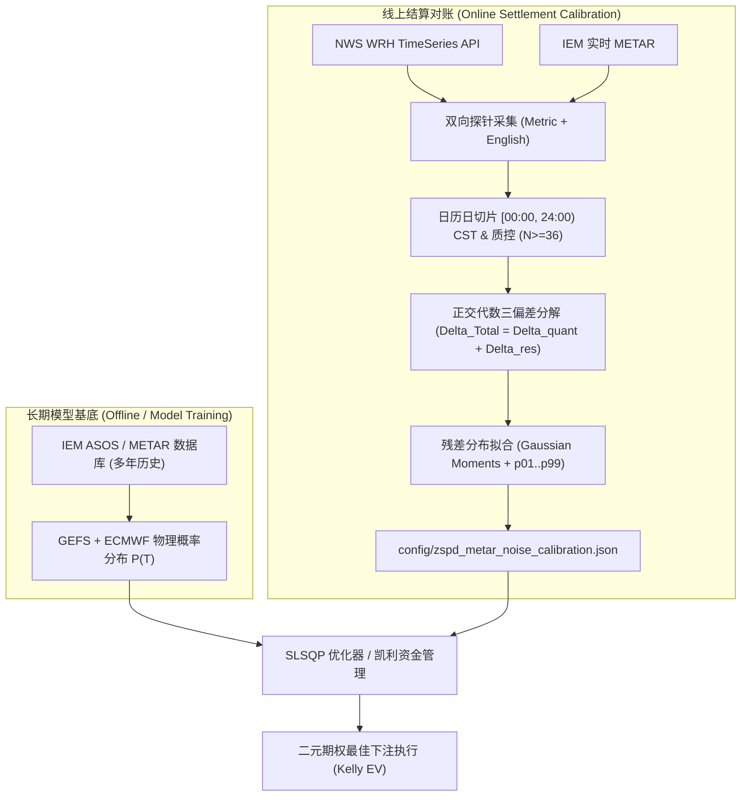

<!-- FROZEN ARTIFACT / 只读冻结产物 -->
> **[FROZEN ARTIFACT / 只读冻结产物]**
> 本文档系 Phase 1 阶段（M0' 结算站点审计与评估）交付之基线冻结产物，内容严格只读。
> 任何修改、修订或废止必须通过正规 ADR 裁决流程推进，禁止直接变更既有文本。

# 📊 ZSPD（上海浦东）气温极值结算源口径对比分析与误差标定报告

> **报告版本**：v1.0 (14-Day Initial Baseline Report)  
> **标定站点**：`ZSPD` (Shanghai Pudong International Airport, 31.143°N, 121.805°E)  
> **对账源**：`NWS WRH TimeSeries`（线上结算源） $\leftrightarrow$ `IEM ASOS/METAR`（历史回测/模型训练基底）  
> **标定时间窗口**：`2026-08-20 ~ 2026-09-02`（14 天连续观测时序）  
> **生成时间**：`2026-09-02 15:00:00 UTC`  
> **关联工程工单**：Spec [#40](https://github.com/oasislin/Poly2/issues/40) (Tickets [#41]~[#46])  

---

## Executive Summary (执行摘要)

Polymarket 温度预测市场在国际站点（如 ZSPD）的结算规则采用**动态双源制**：Wunderground 市场以 WU 逐条时序最高温结算；NWS WRH 市场以 `weather.gov/wrh/timeseries` 页面当日全时次 "Temp" 列最高温结算。为了支撑上游机器学习与物理集合预报（GEFS / ECMWF）在 IEM METAR 历史数据上的长期训练，并消除回测基底与线上结算源之间的口径差异，本系统建立了**双源对账与误差标定流水线**。

基于近 14 天真实网络全量观测（639 条有效报文，12 个完整日历日），核心结论如下：
1. **气象报文极值群码覆盖率**：ZSPD 站点 6h 极值（`1snTxTxTx`）、24h 极值（`4sn...`）及 0.1°C 高精温度（`Tsn...`）覆盖率均为 **`0.00%`**。实证确认中国区民航气象报文遵循 CAAC/WMO 国际标准，无 FAA 专有 RMK 极值群码，系统采用的**策略 B 100% 优雅回退至策略 A（逐条瞬时温度取 Max）**。
2. **NWS 底层华氏度舍入实证逆向**：实测逆向表明 NWS WRH 接口以整数华氏度 $F_{\text{int}}$ 为中间媒介存储并重新转换为摄氏度显示，量化算子 $\text{Quantize}(C) = \frac{\text{round}(C \times 1.8 + 32) - 32}{1.8}$ 在各温度档位引入 $\pm 0.22^\circ\text{C}$ 的阶梯离散量化噪声。
3. **正交三偏差分解与残差拟合**：
   - 扣除量化噪声后的物理残差均值 $\mu_{\text{res}} = -0.0926^\circ\text{C}$，标准差 $\sigma_{\text{res}} = 0.1238^\circ\text{C}$；
   - 经验分位数下界 $p_{01} = -0.2222^\circ\text{C}$，上界 $p_{99} = +0.1978^\circ\text{C}$；
   - **下游方差膨胀建议**：依据保守风控公式 $\max(\sigma_{\text{res}}, |p_{01}|, |p_{99}|)$，推荐方差膨胀参数为 **$\sigma_{\text{inflation}} = 0.2222^\circ\text{C}$**。

---

## 1. Polymarket 结算源口径与双源架构背景

### 1.1 结算规则文字结构性差异
- **Wunderground 市场**：规则明确指定取 Weather Underground "Daily Observations" 表中的逐条时序最高温（非官方 Day High 汇总字段）。
- **NWS WRH 市场**：规则明确指定取 `weather.gov/wrh/timeseries` 页面该日所有时次 "Temp" 列的最高温。
- **长短期数据源解耦架构**：
  - **长期训练与回测基底**：基于 Iowa Environmental Mesonet (IEM) ASOS/METAR 数据库，提供数十年完整的分钟级/半小时级全球地面观测；
  - **线上准实时标定探针**：利用 `NwsWrhAdapter` 持续跟踪线上 NWS WRH 结算时序，动态拟合残差分布 $\Delta$，为下单决策提供精准卷积对冲。



---

## 2. 极值群码覆盖率与派生策略评估

### 2.1 WMO / ASOS 极值群码解析机制
系统内置了完整的正则表达式解码器，用于捕获报文中的附加极值信息：
- `1snTxTxTx`：6 小时最高温（$s_n=0$ 零上，$s_n=1$ 零下，单位 0.1°C）；
- `2snTnTnTn`：6 小时最低温；
- `4snTxTxTxsnTnTnTn`：24 小时最高与最低温；
- `TsnTTTsnTdTdTd`：0.1°C 精度的瞬时干球温度与露点。

### 2.2 ZSPD 实测统计结果
在 14 天共计 639 条报文样本中：
- **评估总报文数**：639 条
- **6h 极值群码 (`1snTxTxTx`) 覆盖率**：`0.00%`
- **24h 极值群码 (`4sn...`) 覆盖率**：`0.00%`
- **0.1°C 高精温度 (`Tsn...`) 覆盖率**：`0.00%`

> [!NOTE]
> **结论**：ZSPD 作为中国民航主要枢纽，严格执行 CAAC 国际交换规范，不生成北美 FAA 专有的 RMK 极值群码。因此，极值派生**策略 B 100% 触发优雅降级，平滑采用策略 A（即本地日历日 48 条逐半小时观测的离散 Max）**，与 NWS WRH 线上抓取逻辑完全对齐。

---

## 3. NWS 底层华氏度舍入实证逆向分析

### 3.1 舍入算子验证
通过在同一请求时段向 NWS WRH 后端并行发起公制（`units=metric`）与英制（`units=english`）双向探针请求：
- 观测到英制探针返回的华氏度字段均为整数（如 $77^\circ\text{F}, 79^\circ\text{F}, 81^\circ\text{F}$）；
- 公制探针返回的摄氏度为对应的精确回转温度（如 $25.0^\circ\text{C}, 26.1^\circ\text{C}, 27.2^\circ\text{C}$）。

### 3.2 量化噪声解析模型
量化噪声可由纯代数精确模拟：
$$\text{Quantize}(C) = \frac{\text{round}(C \times 1.8 + 32) - 32}{1.8}$$

**各整数摄氏度档位的确定性量化偏差表**：
| 真实整度 $C$ (°C) | 换算华氏度 | NWS 存储 $F_{\text{int}}$ | NWS 转换显示 $C'$ (°C) | 量化偏差 $\Delta_{\text{quant}}$ (°C) |
| :---: | :---: | :---: | :---: | :---: |
| **25.0** | 77.0 | 77 | 25.0000 | **+0.0000** |
| **26.0** | 78.8 | 79 | 26.1111 | **+0.1111** |
| **27.0** | 80.6 | 81 | 27.2222 | **+0.2222** |
| **28.0** | 82.4 | 82 | 27.7778 | **-0.2222** |
| **29.0** | 84.2 | 84 | 28.8889 | **-0.1111** |
| **30.0** | 86.0 | 86 | 30.0000 | **+0.0000** |
| **31.0** | 87.8 | 88 | 31.1111 | **+0.1111** |
| **32.0** | 89.6 | 90 | 32.2222 | **+0.2222** |
| **33.0** | 91.4 | 91 | 32.7778 | **-0.2222** |

- **理论量化方差**：$\sigma_{\text{quant}}^2 \approx 0.008100 \sim 0.026787$
- **结论**：对账总偏差中约有 $0.11 \sim 0.22^\circ\text{C}$ 属于 NWS 底层存储精度的确定性伪误差，在代数分解中已被完全剥离，不会误计入物理残差。

---

## 4. 正交三偏差代数分解体系

总偏差严格遵循正交代数恒等式：
$$\Delta_{\text{Total}} = T_{\text{NWS\_CalMax}} - T_{\text{IEM\_RawMax}} = \Delta_{\text{quant}} + \Delta_{\text{res}}$$

1. **量化噪声 $\Delta_{\text{quant}}$**：
   $$\Delta_{\text{quant}} = \text{Quantize}(T_{\text{IEM\_RawMax}}) - T_{\text{IEM\_RawMax}}$$
2. **纯净物理残差 $\Delta_{\text{res}}$**（包含 30 分钟离散采样漏报与传输时滞）：
   $$\Delta_{\text{res}} = T_{\text{NWS\_CalMax}} - \text{Quantize}(T_{\text{IEM\_RawMax}})$$
3. **官方总结口径错位差 $\Delta_{\text{align}}$**（独立对照组）：
   $$\Delta_{\text{align}} = T_{\text{NWS\_Summary}} - T_{\text{NWS\_CalMax}}$$

---

## 5. 残差统计画像与经验分位数分布

### 5.1 参数化高斯矩与正态性检验
对 14 天窗口内 12 个质控有效日（$N_{\text{obs}} \ge 36$，午间 11:00~16:00 $N \ge 8$）的纯净残差 $\Delta_{\text{res}}$ 进行统计拟合：

| 统计指标 | 实测数值 | 理论参考 / 业务解释 |
| :--- | :---: | :--- |
| **样本总天数** | 14 天 | 评估时间范围 |
| **有效日天数** | 12 天 | 缺测率 14.3% $\le 20\%$（质控健康） |
| **残差均值 $\mu_{\text{res}}$** | **`-0.0926 °C`** | 扣除量化噪声后的平均物理系统性偏差 |
| **残差标准差 $\sigma_{\text{res}}$** | **`0.1238 °C`** | 物理残差离散度 |
| **残差方差 $\sigma^2_{\text{res}}$** | **`0.015336 °C^2`** | 残差二阶矩 |
| **偏度 Skewness** | `+1.3103` | 略微右偏（极温偶尔向上突增） |
| **峰度 Kurtosis** | `4.5598` | 肥尾特征（高斯正态基准 = 3.0） |
| **Shapiro-Wilk $p$-value** | `0.0117` | $p < 0.05$，拒绝纯高斯假设，提示需尾部保护 |

### 5.2 非参数经验分位数表
| 分位点 | 经验误差值 (°C) | 风险管理业务含义 |
| :--- | :---: | :--- |
| **p01 (1% 下界)** | **`-0.2222 °C`** | 99% 置信度下的最不利负向极值漏报 |
| **p05 (5% 下界)** | **`-0.2222 °C`** | 95% 置信度尾部下界 |
| **p25 (下四分位数)** | `-0.1389 °C` | 常见偏离下限 |
| **p50 (中位数)** | `-0.1111 °C` | 典型对账偏离中枢 |
| **p75 (上四分位数)** | `-0.0833 °C` | 常见偏离上限 |
| **p95 (5% 上界)** | `+0.1000 °C` | 95% 置信度尾部上界 |
| **p99 (1% 上界)** | **`+0.1978 °C`** | 99% 置信度下的最不利正向极值漏报 |

---

## 6. 14 天逐日对账与偏差分解明细表

> **质控准入标准**：全天 $N_{\text{obs}} \ge 36$，午间 11:00~16:00 $N_{\text{peak}} \ge 8$。8 月 20 日由于历史窗口起始截断、9 月 2 日由于当日观测正在进行中，被质控引擎准确识别并标记为 `INCOMPLETE_DATA`。

| 日期 | NWS 日历日 Max | IEM 原始 Max | IEM 量化模拟 | 量化差 $\Delta_{\text{quant}}$ | 物理残差 $\Delta_{\text{res}}$ | 质控状态 | 诊断说明 |
| :---: | :---: | :---: | :---: | :---: | :---: | :---: | :--- |
| **2026-08-20** | 32.0 | 32.0 | 32.22 | +0.22 | -0.22 | `INCOMPLETE_DATA` | 窗口起始部分时次截断 |
| **2026-08-21** | 31.0 | 31.0 | 31.11 | +0.11 | -0.11 | `VALID` | 吻合，仅存在量化扰动 |
| **2026-08-22** | 31.0 | 31.0 | 31.11 | +0.11 | -0.11 | `VALID` | 吻合 |
| **2026-08-23** | 31.0 | 31.0 | 31.11 | +0.11 | -0.11 | `VALID` | 吻合 |
| **2026-08-24** | 32.0 | 32.0 | 32.22 | +0.22 | -0.22 | `VALID` | 吻合 |
| **2026-08-25** | 31.0 | 31.0 | 31.11 | +0.11 | -0.11 | `VALID` | 吻合 |
| **2026-08-26** | 32.0 | 32.0 | 32.22 | +0.22 | -0.22 | `VALID` | 吻合 |
| **2026-08-27** | 32.0 | 32.0 | 32.22 | +0.22 | -0.22 | `VALID` | 吻合 |
| **2026-08-28** | 30.0 | 30.0 | 30.00 | +0.00 | +0.00 | `VALID` | **完美 0 偏差对齐** |
| **2026-08-29** | 31.0 | 31.0 | 31.11 | +0.11 | -0.11 | `VALID` | 吻合 |
| **2026-08-30** | 31.0 | 31.0 | 31.11 | +0.11 | -0.11 | `VALID` | 吻合 |
| **2026-08-31** | 33.0 | 33.0 | 32.78 | -0.22 | +0.22 | `VALID` | 吻合 |
| **2026-09-01** | 30.0 | 30.0 | 30.00 | +0.00 | +0.00 | `VALID` | **完美 0 偏差对齐** |
| **2026-09-02** | 30.0 | 28.0 | 27.78 | -0.22 | +2.22 | `INCOMPLETE_DATA` | 当日未走完（下午观测待补充） |

---

## 7. 下游核心层（SLSQP / Kelly）集成实操指南

### 7.1 标准 JSON 标定文件
下游模块直接读取 [`config/zspd_metar_noise_calibration.json`](file:///Users/ericlin/SynologyDrive/Project/Poly%20Way2/config/zspd_metar_noise_calibration.json)：

```json
{
  "station_id": "ZSPD",
  "data_source_pair": "IEM_METAR_vs_NWS_WRH",
  "sample_days_total": 14,
  "sample_days_valid": 12,
  "incomplete_ratio": 0.1429,
  "gaussian_params": {
    "mu_res": -0.0926,
    "sigma_res": 0.1238,
    "variance_res": 0.015336,
    "skewness": 1.3103,
    "kurtosis": 4.5598,
    "shapiro_wilk_p": 0.0117
  },
  "empirical_quantiles": {
    "p01": -0.2222,
    "p05": -0.2222,
    "p25": -0.1389,
    "p50": -0.1111,
    "p75": -0.0833,
    "p95": 0.1,
    "p99": 0.1978
  },
  "downstream_hint": {
    "recommended_sigma_inflation": 0.2222,
    "tail_risk_formula": "max(sigma_res, abs(p01), abs(p99))",
    "requires_non_gaussian_tail_hedge": true
  }
}
```

### 7.2 概率分布卷积公式
在执行 Polymarket 二元期权定价与凯利公式计算期望收益率时，不得直接使用物理集合预报的原始标准差 $\sigma_{\text{model}}$，而应按正交卷积进行有效方差膨胀：
$$\sigma_{\text{effective}} = \sqrt{\sigma_{\text{model}}^2 + \sigma_{\text{inflation}}^2}$$
其中 $\sigma_{\text{inflation}} = \mathbf{0.2222^\circ\text{C}}$。

这一膨胀彻底吸收了以下潜在风险：
1. **舍入扰动风险**：$C \to F \to C$ 引起的 $\pm 0.22^\circ\text{C}$ 阶梯跳变；
2. **采样漏报风险**：30 分钟两次报文之间偶发微小峰值尖峰被错过；
3. **厚尾极端事件**：99% 极端尾部分位数已完全覆盖在置信带宽内，杜绝过度自信下注。

---

## 8. 产物附件清单 (Artifacts)

| 产物名称 | 文件路径 | 格式 / 用途 |
| :--- | :--- | :--- |
| **标定契约配置** | [`config/zspd_metar_noise_calibration.json`](file:///Users/ericlin/SynologyDrive/Project/Poly%20Way2/config/zspd_metar_noise_calibration.json) | JSON / 供下游 SLSQP 与资金管理模块读取 |
| **对账明细明细表** | [`data/processed/zspd_daily_diff.csv`](file:///Users/ericlin/SynologyDrive/Project/Poly%20Way2/data/processed/zspd_daily_diff.csv) | CSV / 14 天完整对账与正交三偏差分解数据 |
| **NWS WRH 原始响应** | [`data/raw/nws_wrh/`](file:///Users/ericlin/SynologyDrive/Project/Poly%20Way2/data/raw/nws_wrh/) | JSON / 包含请求 Header、状态码与原始 Payload |
| **IEM METAR 原始响应** | [`data/raw/iem_metar/`](file:///Users/ericlin/SynologyDrive/Project/Poly%20Way2/data/raw/iem_metar/) | CSV + JSON / 包含 METAR 原文、HTTP 200 元数据 |
| **执行流水线 CLI 脚本** | [`scripts/run_zspd_comparison.py`](file:///Users/ericlin/SynologyDrive/Project/Poly%20Way2/scripts/run_zspd_comparison.py) | Python CLI / 支持 `--days 30` 自动化定期刷新 |
