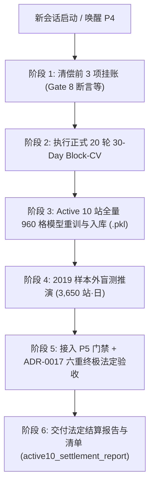

# Handoff 指南：Phase 2 Task 01 (P4) Active 10 站生产级物理模型重训与终极验收

> **交接日期**: 2026-10-08  
> **前置会话**: [`P2 Task01 Fix`](conversation://8f3244dd-d052-438f-977a-9a6fd2754d37) (`8f3244dd-d052-438f-977a-9a6fd2754d37`)  
> **基准代码库状态**: `main` 分支（Commit: `3aab9e6`，Tag: `p5-v1.0-verified`，工作区干净）  
> **接收对象**: 新会话 Agent（执行 P4 生产级物理概率模型重训、20 轮 Block-CV、P5 抽检门禁联动与 2019 样本外终极验收）  
> **核心使命**: 唤醒因等待 P5 评测工具链而处于工程冻结的 P4 物理建模组，清偿挂账，全量重训 Active 10 站 960 格生产模型矩阵，接通生产级 P5 抽检门禁，完成 2019 年 3,650 站·日样本外终极法定验收！

---

## 一、 战略背景与当前定调 (Context & Executive Summary)

1. **P5 评测工具链全面收官（前置依赖已完全解除）**：
   - 此前 P4 建模组在完成工作队列五项扫尾、多起点全网格重拟与 3 折工程干跑后，依据 [`evidence/p4_freeze_handoff_notice.md`](file:///Users/ericlin/SynologyDrive/Project/Poly%20Way2/evidence/p4_freeze_handoff_notice.md)（文件编号 `POLY-R2-P4-FREEZE-001`）**正式冻结于阻塞节点 1**，挂账等待 P5 评测工具链恢复；
   - 截至 2026-09-29，P5 验证层已通过监考盲测 19/19、规格修订 #4、第二层五场景门禁（GATE-L2-01 至 05 全绿）、主线接线层交付并正式打标 `p5-v1.0-verified`；
   - **P4 唤醒的全部硬性前置条件现已 100% 具备**。

2. **前序会话 (`P2 Task01 Fix`) 沉淀的核心资产**：
   - **P1 代码硬闸**：[`src/utils/airgap.py`](file:///Users/ericlin/SynologyDrive/Project/Poly%20Way2/src/utils/airgap.py)（2019 年数据白名单校验与授权阻断，杜绝数据前瞻）；
   - **P2 资产隔离**：旧版 800 个 `.pkl` 已物理迁移至 `data/models/archive_legacy_20260920/`，历史未预注册统计数据已标记 QUARANTINED 隔离；
   - **P3 块交叉验证引擎**：[`src/modeling/resampling.py`](file:///Users/ericlin/SynologyDrive/Project/Poly%20Way2/src/modeling/resampling.py)（30 天块连续重采样、`seed=20260923` 锁定、循环内即时重训）；
   - **P4 预注册规格**：[`specs/preregistration-p4-active10-retrain.md`](file:///Users/ericlin/SynologyDrive/Project/Poly%20Way2/specs/preregistration-p4-active10-retrain.md)（包含 3D 锚点表、双轨覆盖率定义、非高斯分布遴选策略）。

---

## 二、 唤醒第一步：四项挂账清偿清单 (Awakening & Pending Manifest)

依据 `POLY-R2-P4-FREEZE-001` 的法定约束，新会话启动后**严禁直接跑 CV**，必须优先清偿以下挂账事项：

| 序号 | 挂账事项 | 动作要求 | 执行节点 |
| :---: | :--- | :--- | :--- |
| **1** | **Gate 8 套件补 EVT 全域积分断言** | 在测试套件中为 EVT CDF 补上全域积分归一化断言（$F(+\infty) = 1.0$，数值积分 $\ge 0.9999$） | **唤醒后第 1 个 commit** |
| **2** | **测试计数对账说明** | 澄清回归测试用例数自 849 增至 850（与此前单测增补差 1 说明对账） | 唤醒后首个汇报中陈述 |
| **3** | **干跑内存 1.53MB 口径注明** | 澄清工程干跑报告中 1.53MB 为增量分配还是真实峰值 | 唤醒后首个汇报中陈述 |
| **4** | **夏季 $c_{\text{train}}$ 物理机理注记数字回填** | 针对夏季对流与方差膨胀系数回填实测统计数值 | 20 轮 CV 跑完后填入交付报告 |

---

## 三、 P5 生产门禁接线规范 (Integration with P5 Gate)

新会话在验证模型训练产物与 2019 样本外时，必须严格通过 P5 统一门禁，禁止直接依赖底层算法脚本：

```python
# 法定接入方式（详见 docs/p5_integration.md）
from src.verification import run_reliability_gate, GateReport

# 方式 A：传入预测概率与结算真值 DataFrame (p_pred, hit)
report: GateReport = run_reliability_gate(predictions_df)

# 方式 B：传入预测分布参数 DataFrame (obs, mu, sigma)
report: GateReport = run_reliability_gate(forecast_df)

# 硬性阻断判定
if not report.passed:
    raise RuntimeError(f"未通过 P5 生产可靠性门禁: {report.error_message}")
```

- **放行硬指标**: `report.passed == True`
  - Weighted ECE $\le 5.0\%$
  - Wilson 覆盖率 $\ge 90.0\%$
  - 物理下限 $\sigma \ge 0.90^\circ\text{F}$
  - 非退化全同流（`report.is_degenerate == False`）
  - S1–S5 阶梯全项通过（`report.s_ladder_status`）

---

## 四、 后续工作全景执行路线 (Step-by-Step Roadmap)

新会话承接后的分阶段实施路径：



### 阶段 1：唤醒确认与挂账清偿
1. 提交 Gate 8 套件补充 EVT 全域积分断言（`tests/unit/modeling/test_evt_tail_calibration.py` 或对应 gate 测试）；
2. 运行单测确认 850 用例全绿；
3. 输出首个汇报（包含挂账项 2、3 说明）。

### 阶段 2：执行正式 20 轮 30-Day Block-CV 跑数
1. 运行 [`src/modeling/resampling.py`](file:///Users/ericlin/SynologyDrive/Project/Poly%20Way2/src/modeling/resampling.py) 中的 `run_block_cv`；
2. 严格限定于 **2000–2018 训练数据**（Active 10 宇宙），固定随机种子 `20260923`；
3. 循环内调用拟合管线 `fit_statutory_pipeline_fold`；
4. 汇总各折泛化表现，确认非正态候选集分布拟合优度，产出 CV 诊断总表并回填挂账项 4。

### 阶段 3：Active 10 站生产模型矩阵拟合与序列化
1. 确定 10 站 $\times$ 4 季节 $\times$ 多提前期的最终参数（共 960 格）；
2. 生成符合生产规范的标准序列化模型权重（入库至 `data/models/`，淘汰隔离旧资产）；
3. 刷新生成 `data/models/manifest.json`，计算 SHA-256 并签署版本。

### 阶段 4：2019 样本外推演（3,650 站·日）
1. 依据预注册授权机制（`evidence/preregistered_2019_authorization.flag`）合法解锁 2019 数据读取；
2. 保持因果去偏预热（2018 年末 60 天数据预热滑动窗口 $W=30$）；
3. 生成 Parquet 审计底账：`data/processed/audit_arrays/2019_oos_active10_arrays.parquet`。

### 阶段 5：P5 生产门禁联动与 ADR-0017 六重终极验收
1. 调用 `run_reliability_gate` 验证全局可靠性；
2. 执行六大终极法定验收门禁：
   - [ ] 随机化 PIT K-S 拟合检验 $p \ge 0.05$（有限样本精确反解）；
   - [ ] 7 档位离散加权 ECE $\le 3.0\%$（依据 ADR-0017 半度连续性积分）；
   - [ ] 样本外方差比 $s_{\text{oos}} = \text{Var}(r) / \mathbb{E}[\sigma_f^2] \in [0.85, 1.15]$；
   - [ ] 样本外 PIT 均值 $\in [0.46, 0.54]$；
   - [ ] 90% 名义区间覆盖率 $\in [83\%, 95\%]$；
   - [ ] 均值层纯净性（MAE 与基线保持严格一致）。

### 阶段 6：法定工件交付与独立复算闭环
1. 撰写覆盖 10 站的唯一法定结算报告：`evidence/active10_settlement_report.md`；
2. 提供零外部依赖独立复算脚本：`scripts/standalone_recompute_active10.py`（复算误差 $< 10^{-6}$）；
3. 汇总更新 `evidence/active10_manifest.json` 全生命周期哈希底账。

---

## 五、 核心资产与工程路径索引

| 类别 | 关键文件路径 | 作用与用法 |
| :--- | :--- | :--- |
| **预注册规格** | [`specs/preregistration-p4-active10-retrain.md`](file:///Users/ericlin/SynologyDrive/Project/Poly%20Way2/specs/preregistration-p4-active10-retrain.md) | P4 重训法定纲领（参数格数、先验、门禁） |
| **P5 接线指南** | [`docs/p5_integration.md`](file:///Users/ericlin/SynologyDrive/Project/Poly%20Way2/docs/p5_integration.md) | P5 唯一调用契约说明 |
| **P5 门禁入口** | [`src/verification/p5_gate.py`](file:///Users/ericlin/SynologyDrive/Project/Poly%20Way2/src/verification/p5_gate.py) | `run_reliability_gate` / `GateReport` 实现 |
| **重采样引擎** | [`src/modeling/resampling.py`](file:///Users/ericlin/SynologyDrive/Project/Poly%20Way2/src/modeling/resampling.py) | 30 天块 Block-CV 引擎与拟合管线 |
| **代码硬闸** | [`src/utils/airgap.py`](file:///Users/ericlin/SynologyDrive/Project/Poly%20Way2/src/utils/airgap.py) | 2019 数据隔离与反泄露保护模块 |
| **冻结通知** | [`evidence/p4_freeze_handoff_notice.md`](file:///Users/ericlin/SynologyDrive/Project/Poly%20Way2/evidence/p4_freeze_handoff_notice.md) | 挂账四项的法定出处 |
| **黄金标杆** | [`evidence/round3_settlement_report.md`](file:///Users/ericlin/SynologyDrive/Project/Poly%20Way2/evidence/round3_settlement_report.md) | 先导 3 站结算报告范本 |

---

## 六、 铁律与纪律红线 (Strict Engineering Discipline)

1. **严禁未经明确授权擅自修改代码（最高铁律）**：任何操作先陈述方案与设计，获明确授权后再写代码；
2. **原始观测结果不可篡改（最高铁律）**：跑数指标、ECE、覆盖率等客观实测数值原样读取、原样汇报，严禁四舍五入美化；
3. **2019 时间墙零前瞻泄漏**：CV 与参数拟合只能使用 2000–2018 年数据，严禁触碰 2019 数据；
4. **唤醒顺序不可跳跃**：优先完成 Gate 8 套件全域积分断言，确认全绿后，方可启动 Block-CV 跑数；
5. **解释器环境与测试证据规范 (DEF-08 规程)**：
   - 生产与测试唯一指定解释器环境严格锁定为：Python 3.13.5 + pytest 8.3.4（由 `requirements.txt` 与 `pyproject.toml` 固化，禁用 anyio 插件）；
   - 跑数与测试汇报必须原样记录 `pytest header` 原文（含 platform、Python 版本、pytest 版本、configfile 行）；无 header 的输出不作为法定证据。
