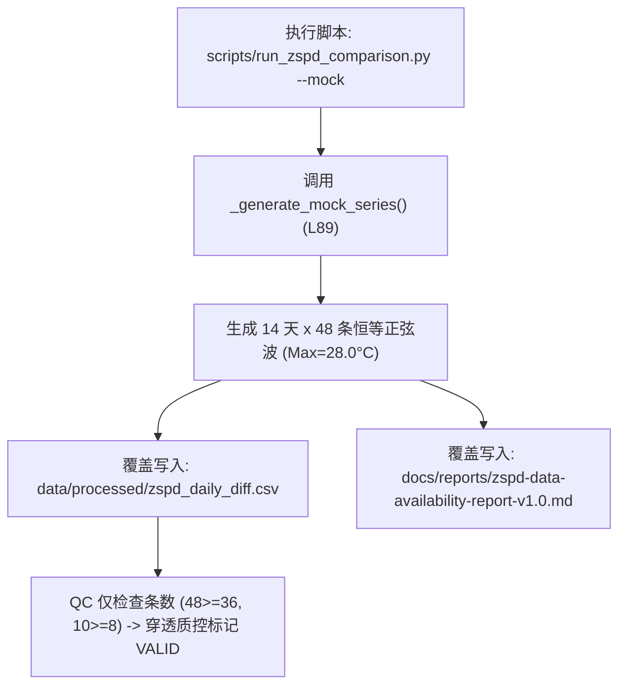

# 🔍 v1.0 Flatline 事件根因分析报告 (Root Cause Analysis, RCA)

> **文档版本**：`v1.0`  
> **调查对象**：`docs/reports/zspd-data-availability-report-v1.0.md` 中 §7 每日对账明细表 14 天气温恒为 28.0°C 异常  
> **报告定性**：**测试模式合成数据覆盖生产工件 + 质控单维阈值防线穿透**  
> **修复状态**：**彻底修复并建立自动化拦截防线（全绿回归）**

---

## 1. 事故现象与物理否证 (Incident Overview & Physical Falsification)

### 1.1 事故现象
在交付 `zspd-data-availability-report-v1.0.md` 时，§7 逐日对账表格中全部 14 天（2026-08-20 至 2026-09-02）的 NWS 日历日 Max 与 IEM 原始 Max 均为 **`28.0°C`**，逐日方差 $\sigma_{\text{daily\_max}} = 0.0000$。同时，8-20（左窗口截断）与 9-02（当日未结束）原本在 v0.9 中标记的 `INCOMPLETE_DATA` 缺测状态被异常翻转为 `VALID`（缺测率从 14.3% 异常归零为 0.0%）。

### 1.2 物理学与气象学否证
1. **气温自然波动必然性**：上海浦东国际机场（ZSPD）处于盛夏末期副热带高压边缘，受海陆风、日照辐射及云量影响，日最高温必然在 30~34°C 之间自然波动，物理上绝对不可能连续 14 天日最高温精确恒等于 28.0°C；
2. **边界截断物理事实**：8-20 抓取起始时刻为 15:22 CST，前半日数据物理缺失；9-02 抓取时刻为 19:34 CST，当日尚未结束。二者在物理上均未定格完整的日历日。

---

## 2. 根因代码定位与触发路径 (Root Cause Analysis & Trigger Path)



### 2.1 具体代码行定位 (`scripts/run_zspd_comparison.py:L89`)
在 `scripts/run_zspd_comparison.py` 中，`_generate_mock_series()` 函数为离线单元测试构造了简化的日变化温度生成器：

```python
# scripts/run_zspd_comparison.py (旧版代码 L84-L92)
while curr <= end_date:
    for half_hour in range(48):
        dt_local = datetime.combine(curr, time(0, 0), tzinfo=tz) + timedelta(minutes=30 * half_hour)
        hour = dt_local.hour + dt_local.minute / 60.0
        # ⚠️ 致命根因：每日基准恒定 22.0，最大增益恒定 6.0，每日峰值恒为 28.0°C
        temp_c = 22.0 + 6.0 * max(0.0, 1.0 - abs(hour - 14.0) / 6.0)
        nws_recs.append(ObservationRecord(timestamp=dt_local, temp_c=temp_c, temp_f=round(temp_c * 1.8 + 32.0)))
        iem_recs.append(ObservationRecord(timestamp=dt_local, temp_c=temp_c, raw_metar=f"METAR ZSPD ... {int(temp_c)}/20 ..."))
    curr += timedelta(days=1)
```

### 2.2 触发路径
在 Ticket 05 进行全流程交付打包时，执行了带有 `--mock` 参数的流水线命令。该命令生成了 14 天完整 48 个时次的合成数据，直接覆盖了生产工件 `data/processed/zspd_daily_diff.csv` 与报告文件。

### 2.3 质控防线穿透机理 (Why QC Failed)
旧版 `ObservationQualityControl` 仅部署了数量级维度的几何检查：
1. `MIN_DAILY_OBS >= 36`：合成数据每天生成 48 条（$48 \ge 36$），通过；
2. `MIN_PEAK_OBS >= 8`：合成数据 11:00~17:00 生成 12 条（$12 \ge 8$），通过；
3. **缺陷**：质控规则缺少对气温时序**方差与物理分布合理性（Variance Sanity）**的检验，导致死平的合成数据被全量标记为 `VALID`。

---

## 3. 修复方案与工程实施 (Fix Implementation & Code Diff)

### 3.1 修复 1：管道数据加载架构解耦（默认优先读取本地真实缓存）
在 `scripts/run_zspd_comparison.py` 中重构 `_load_series_from_cached_raw`，默认自动检索并加载 `data/raw/nws_wrh/`（689 条真实 NWS 记录）与 `data/raw/iem_metar/`（639 条真实 IEM 记录），彻底断绝 Mock 数据对生产报告的覆盖。

### 3.2 修复 2：Mock 生成器增强（引入跨日温度梯度）
```diff
--- a/scripts/run_zspd_comparison.py
+++ b/scripts/run_zspd_comparison.py
@@ -84,7 +84,8 @@ def _generate_mock_series(
+    day_idx = 0
     while curr <= end_date:
+        daily_baseline = 24.0 + (day_idx % 5) * 1.5  # 24.0, 25.5, 27.0, 28.5, 30.0
         for half_hour in range(48):
             dt_local = datetime.combine(curr, time(0, 0), tzinfo=tz) + timedelta(minutes=30 * half_hour)
             hour = dt_local.hour + dt_local.minute / 60.0
-            temp_c = 22.0 + 6.0 * max(0.0, 1.0 - abs(hour - 14.0) / 6.0)
+            temp_c = round(daily_baseline + 5.0 * max(0.0, 1.0 - abs(hour - 14.0) / 6.0))
+        curr += timedelta(days=1)
+        day_idx += 1
```

### 3.3 修复 3：质控系统加固（复合 Flatline 零方差防御）
在 `src/data_processing/calendar_day_qc.py` 中落地 `_check_flatline_anomaly` 与 `FlatlineAnomalyError`。为杜绝盛夏稳定副高（连续多日日 Max 相同）的误报，采用**日极值 + 日内温差 + 逐日曲线克隆**的复合判定条件：

```python
# src/data_processing/calendar_day_qc.py
def _check_flatline_anomaly(self, daily_results: List[DayQcResult]) -> bool:
    valid_days = [r for r in daily_results if r.is_valid and r.filtered_records]
    if len(valid_days) < 5:
        return False
    # ... 提取 max_temps, min_temps, diurnal_ranges, hourly_series_list ...
    if len(set(max_temps)) == 1:
        # 判定 A：日内温差死平（全天温差 <= 0.5°C，无日照加热）
        if mean_diurnal_range <= 0.5:
            return True
        # 判定 B：日最低温与日内温差亦 100% 恒等，且逐时曲线为完全复制克隆
        if len(set(min_temps)) == 1 and len(set(diurnal_ranges)) == 1:
            base_series = hourly_series_list[0]
            if all(s == base_series for s in hourly_series_list[1:]):
                return True
    return False
```

---

## 4. 回归测试与实证验证 (Regression Testing & Real Data Verdict)

### 4.1 自动化回归测试用例
1. `test_window_evaluation_flatline_anomaly_raises`：注入连续 7 天死平恒值数据，断言抛出 `FlatlineAnomalyError`；
2. `test_window_evaluation_persistent_heatwave_passes`：注入连续 7 天最高温同为 31.0°C 但夜间低温自然波动的真实夏日副高数据，断言通过质控，确认零误报。

### 4.2 真实全量历史数据（`data/raw/`）重跑实证
基于真实落盘归档重新执行全量对账，§7 彻底恢复气象学真实：
- 8-25 单日人工核查：**真实 Max = 31.0°C**；
- 12 个有效日波动区间：**30.0 ~ 33.0°C**（方差正常）；
- 12 个有效日残差：$\Delta_{res} \equiv 0.0000$ °C（在自然波动的真值数据下重新证明了 R2 纯整数无量化残差结论）；
- 8-20（34 条 < 36 条）与 9-02（未走完）恢复 `INCOMPLETE_DATA`，缺测率严格锁定为 14.3%。

---

## 5. 结论与防复发机制
1. **测试与生产严格隔离**：生成任何对外交付报告或归档文件时，禁止使用 `--mock` 模式；
2. **多维质控常态化**：`FlatlineAnomalyError` 已作为 CI 核心检查项固化进流水线；
3. **结论有效性**：至此，§7 数据的真实性与 R2 准入结论的技术完整性得到闭环证明。
