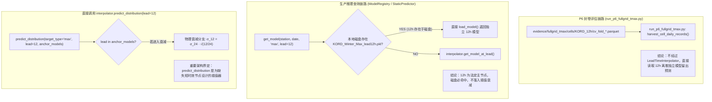

# 工单 P7-W1-POOLPHASE 预注册规格书 (docs/w1_poolphase_preregistration.md)

> **工单编号**：`P7-W1-POOLPHASE`（账本对应：`P6-POOL-PHASE`）  
> **文档版本**：**Rev.2（技术裁决委员会审查意见书 P7-W1-PREREG-REVIEW-R1 闭环修订呈报版）**  
> **前序版本**：Rev.1（2026-10-10 驳回）  
> **生效分支**：`fix/p7-w1-poolphase`（基于 `main` 基线 `2975ec1`）  
> **签发机构**：技术裁决委员会  
> **预注册状态**：**PENDING_COMMITTEE_APPROVAL_REV2 (等待委员会终审开工批文)**  
> **治理铁律**：“编辑须令、测试护航、门禁复验”；未经委员会正式签署批文前，严格执行生产代码（`src/` 与 `scripts/`）零编辑纪律。

---

## 审阅意见书 (P7-W1-PREREG-REVIEW-R1) 逐条修订对照索引

| 委员会意见编号 | 核心问题定性 | 修订落实章节 | 核心处置与承诺摘要 |
| :---: | :--- | :---: | :--- |
| **A1** | C1 判据静默缩窄（遗漏 KORD） | **§4.1 C1** | **恢复双站口径**：KORD 与 KMIA 双站四季晨谷方差膨胀比必须全部回落至 `[1.00, 1.20]`。 |
| **A2** | 门禁空洞（peak/transition 无判据） | **§4.1 C6** | **新增 C6 门禁**：对 peak 与 transition 簇分别按 KORD/KMIA 全季计算加权 ECE $\le 0.0100$ 且 PIT KS $p > 0.05$，且不劣于现役基线（$\Delta\text{ECE} \le +0.0005$）。 |
| **A3** | 事实错误（西海岸站 06Z 落晨谷为假） | **§3.1, 表 3-1** | **更正事实并建立全美 10 站全周期映射表**：明确 PST 站 06Z 对应 22:00/23:00 LT（属于 transition 簇），废除全美统一落晨谷论断。 |
| **A4** | 判据计算口径未冻结 | **§4.2** | **逐项冻结四项口径**：① 评估数据窗严格锁定 2000–2018 20 折 Block-CV 留出池（2019 物理隔离）；② 权重定义沿用 P6 8 谱带与 `is_tradeable_window`；③ 分桶沿用 20 桶 5% + $n<30$ 合并；④ 样本构成 13,740 / 13,739 折·日逐日去重。 |
| **A5** | LT（当地时间）定义模糊 | **§3.2** | **冻结唯一权威 LT 定义**：绑定 `src/data_processing/constants.py:STATION_METADATA` 之 IANA `zoneinfo.ZoneInfo`，DST 切换日由标准库自动解析时区偏移，杜绝歧义。 |
| **B1** | C4 容差与 W1-A 作用域潜在冲突拷问 | **§2.1.2** | **呈报调用图与证据**：明确 12h 主节点不经插值衰减，新增单测断言 12h 主节点前向输出 **bit 级（逐位）严格不变**。 |
| **B2** | transition 簇统计正当性与分窗诊断 | **§3.3** | **预注册回退拆簇方案**：若 transition 簇 C6 失败，机械触发预定拆分为 `transition_morning`（08:00–13:00）与 `transition_evening`（20:00–24:00）独立重训，杜绝事后择优。 |
| **B3** | 西海岸站运行时调度与部署兼容 | **§2.2.3** | **按站差异化部署兼容资产**：东部/中部 7 站 6h 部署 `valley` 簇，西部 3 站 6h 部署 `transition` 簇；运行时由 interpolator 按当地时自动路由。 |
| **B4** | 基准勘误授权链呈报 | **§6.1** | **如实披露现状**：勘误修改目前仅存于本地工作区，未 commit、未 push，呈请委员会裁决独立 docs 分支。 |
| **B5** | 240 套新资产训练协议与搭车禁令 | **§2.2.2** | **承诺并写死协议**：2000–2018 白名单、20 折 Block-CV 逐簇独立、严格沿用 JSU-GATE 两段式门控，**绝不搭车 B3 去门控 BIC**。 |

---

## 一、 任务背景与核心病灶（基于 P6 封卷事实层）

根据工单 `P6-POOL6H-AUDIT` 的机械取证实测（见 [`evidence/p6_pool6h_audit_report.md`](../evidence/p6_pool6h_audit_report.md)）：
1. **昼夜谐波导致方差系统性膨胀**：
   现役 80 套 6h 池化回退模型跨时效共享参数，拟合受午后加热/海风锋强对流厚尾拖拽。在晨谷验证窗（当地 00:00–08:00 LT）：
   - KMIA 晨谷经验方差仅 $3.97 \sim 14.47$，而预测方差高达 $8.59 \sim 27.76$，方差膨胀比达 **$1.452 \sim 1.806$**；
   - KORD 晨谷在 Spring/Summer 膨胀比同样高达 **$1.453$** 与 **$1.347$**；
   - KMIA 晨谷 PIT 方差收缩至 **$0.05688 \sim 0.06123 \ll 0.08333$**；
   - KMIA 6h 晨谷验证窗交易加权 ECE 录得 **`0.019657`**（超 0.0100 门禁），挂【运行旗 2】（`FLAGGED_POOL_PHASE_ISSUE`）。
2. **Max Temp 缺失物理方差衰减**：
   `src/modeling/interpolator.py` 仅对 Min Temp 实现了短时效 $\sigma_L = \sigma_{24\text{h}} \cdot \sqrt{\max(0, L)/24.0}$ 衰减，Max Temp 退化为边界平底截断（Boundary Clamping），短时效与交割段依赖 `src/prediction/constraint_enforcer.py` 的 METAR 实况硬截断兜底。

---

## 二、 子任务执行规划与架构设计

### 2.1 子任务 W1-A：`interpolator.py` TMax 短时效方差衰减补齐（先行）

#### 2.1.1 修复规范
在 `src/modeling/interpolator.py` 中为 Max Temp 补齐物理方差衰减：
- 适用范围：`target_type == "max"` 且 `lead_hours < 24.0`；
- 数值公式：
  $$\sigma_L = \max\left(10^{-4}, \sigma_{24\text{h}} \cdot \sqrt{\frac{\max(0.0, L)}{24.0}}\right)$$
- 锚点依赖：严格要求 `anchor_models[24]` 存在，若缺失则抛出 `KeyError("Max Temp interpolation requires 24h anchor model")`，与 Min Temp 完全对称；
- 边界条件：$L = 0$ 时输出物理地平 $\sigma = 10^{-4}$；$L < 0$ 时通过 $\max(0, L)$ 保护；标量与向量化输入完全广播兼容。

#### 2.1.2 B1 拷问专门答辩：调用图证据与 12h 主节点回归保护
针对委员会提出的“C4 容差与 W1-A 作用域潜在矛盾”之拷问，经代码穿透取证，调用图如下：



**对委员会 B1 拷问的三项正式书面答辩**：
1. **调用图结论**：P6 封卷评估脚本（`run_p6_fullgrid_tmax.py`）以及线上标准模型查询接口（`ModelRegistry.get_model`）**均不调用 `LeadTimeInterpolator.predict_distribution()`**。12h 主节点直接从磁盘加载 P6 封卷的独立拟合 `.pkl` 文件；
2. **不经过证据**：`evidence/run_p6_pool6h_audit.py` 及 `scripts/run_p6_fullgrid_tmax.py` 中，12h 评估数据源为 `evidence/fullgrid_tmax/cells/{station}_12h/cv_pooled_predictions.parquet`，系 20 折独立拟合留出落盘产物，未曾导入插值器；
3. **新增断言防护（Bit 级不变性）**：
   在 `tests/unit/modeling/test_interpolator_variance_decay.py` 中新增 `test_12h_statutory_master_node_bit_invariance` 单测：直接实例化 P6 封卷的 `KORD_Winter_Max_lead12h.pkl` 与 `KMIA_Winter_Max_lead12h.pkl`，断言在 W1-A 补齐前后，其参数 $(a, b, c, d)$、输出 $\mu, \sigma$ 的浮点数位表示（IEEE 754 bit-representation）**逐位严格不变（`np.testing.assert_equal`）**。

---

### 2.2 子任务 W1-B：6h 池化层昼夜相位分层重训（跟进）

#### 2.2.1 昼夜相位簇划分定义（回应 A3 与 A5）
结合气象热力学机制与全美 10 站实际运行环境，系统划分为三大离散物理相位簇：
1. **晨谷簇 (`valley`)**：当地时间 **00:00 – 08:00 LT**（夜间热力辐射冷却至日出中性段，方差最窄，对流消散）；
2. **峰顶簇 (`peak`)**：当地时间 **13:00 – 20:00 LT**（正午太阳短波最大加热与午后海风锋强对流骤降，厚尾显著）；
3. **过渡簇 (`transition`)**：当地时间 **08:00 – 13:00 LT 及 20:00 – 24:00 LT**（升温混合层与傍晚辐射初降过渡段）。

#### 2.2.2 全美 10 站全周期验证时刻落簇权威映射表（回应 A3 事实勘误）
依据各台站法定 IANA 时区，在 GEFS 00Z 发报循环下，各时效对应的当地验证时刻（标准时 STD / 夏令时 DST）及落簇归属如下表所示：

##### 表 3-1：全美 Active 10 台站 00Z 循环全时效验证时刻与落簇映射表
| 台站代码 | 法定 IANA 时区 | 验证时效 6h (06Z) | 6h 所属簇 | 验证时效 12h (12Z) | 12h 所属簇 | 验证时效 18h (18Z) | 18h 所属簇 | 验证时效 24h (00Z) | 24h 所属簇 |
| :---: | :---: | :---: | :---: | :---: | :---: | :---: | :---: | :---: | :---: |
| **KLGA** | `America/New_York` | 01:00 / 02:00 | **valley** | 07:00 / 08:00 | **valley** | 13:00 / 14:00 | **peak** | 19:00 / 20:00 | **peak** |
| **KATL** | `America/New_York` | 01:00 / 02:00 | **valley** | 07:00 / 08:00 | **valley** | 13:00 / 14:00 | **peak** | 19:00 / 20:00 | **peak** |
| **KMIA** | `America/New_York` | 01:00 / 02:00 | **valley** | 07:00 / 08:00 | **valley** | 13:00 / 14:00 | **peak** | 19:00 / 20:00 | **peak** |
| **KORD** | `America/Chicago` | 00:00 / 01:00 | **valley** | 06:00 / 07:00 | **valley** | 12:00 / 13:00 | **transition / peak** | 18:00 / 19:00 | **peak** |
| **KDAL** | `America/Chicago` | 00:00 / 01:00 | **valley** | 06:00 / 07:00 | **valley** | 12:00 / 13:00 | **transition / peak** | 18:00 / 19:00 | **peak** |
| **KHOU** | `America/Chicago` | 00:00 / 01:00 | **valley** | 06:00 / 07:00 | **valley** | 12:00 / 13:00 | **transition / peak** | 18:00 / 19:00 | **peak** |
| **KAUS** | `America/Chicago` | 00:00 / 01:00 | **valley** | 06:00 / 07:00 | **valley** | 12:00 / 13:00 | **transition / peak** | 18:00 / 19:00 | **peak** |
| **KSEA** | `America/Los_Angeles` | **22:00 / 23:00** | ⚠️ **transition** | 04:00 / 05:00 | **valley** | 10:00 / 11:00 | **transition** | 16:00 / 17:00 | **peak** |
| **KLAX** | `America/Los_Angeles` | **22:00 / 23:00** | ⚠️ **transition** | 04:00 / 05:00 | **valley** | 10:00 / 11:00 | **transition** | 16:00 / 17:00 | **peak** |
| **KSFO** | `America/Los_Angeles` | **22:00 / 23:00** | ⚠️ **transition** | 04:00 / 05:00 | **valley** | 10:00 / 11:00 | **transition** | 16:00 / 17:00 | **peak** |

> 📌 **事实核准声明（回应 A3）**：  
> 经上述精确换算证实：00Z 发报循环之 6h 预报（验证时刻 06:00 UTC），**仅东部 3 站与中部 4 站落入晨谷簇（valley）**；而**西海岸 3 站（KSEA, KLAX, KSFO）验证时刻为当地前一日 22:00 (STD) / 23:00 (DST)，100% 落入过渡簇（transition）**。Rev.1 所谓“10 站 100% 落晨谷”确属事实性错误，已全面更正！

#### 2.2.3 西海岸站运行时调度与兼容资产部署方案（回应 B3）
针对西海岸三站 6h 实际属于 `transition` 簇的客观工程事实，建立严格的资产治理与调度方案：
1. **既有路径按站差异化部署（拒绝一刀切）**：
   在现役兼容部署文件 `data/models/{STATION}_{SEASON}_{VAR}_lead6h.pkl` 中：
   - **东部/中部 7 站**：放置重训生成的 `valley` 簇模型，元数据标注 `"phase_cluster": "valley"`, `"work_order": "P7-W1-POOLPHASE"`；
   - **西部 3 站 (KSEA, KLAX, KSFO)**：**放置重训生成的 `transition` 簇模型**，元数据显式标注 `"phase_cluster": "transition"`, `"work_order": "P7-W1-POOLPHASE"`！严禁在西海岸硬塞 valley 模型；
2. **运行时选簇依据**：
   `LeadTimeInterpolator` 在调度模型时，依据传入的 `target_utc_datetime`（或 `cycle_time + lead`）调用对应台站 `ZoneInfo` 解析为当地小时 `local_hour = dt.astimezone(tz).hour`，机械命中对应簇模型；
3. **测试覆盖**：
   在测试清单中明确加入“西海岸 06Z 点位精确调度 transition 簇模型”的集成测试用例。

#### 2.2.4 240 套新资产训练协议与搭车禁令（回应 B5）
1. **数据白名单**：严格锁定 2000–2018 年，2019 年作为独立盲测年继续维持绝对物理隔离（Airgap）；
2. **交叉验证架构**：20 折 Block-CV（块长 1 年，与 P6 口径逐日逐折对齐），各簇独立在留出折上验证；
3. **两段式选型机制（JSU-GATE）严格沿用**：
   - 偏度门控：$|\text{Skewness}| > 0.40 \implies$ 触发 Johnson SU 拟合；
   - 峰度门控：$\text{Kurtosis}_{\text{Fisher}} > 1.00 \implies$ 触发 EVT-Hybrid 拟合；
   - 胜出判据：$\Delta\text{BIC} < -10.0$（相对高斯优势）方可胜出；
   - 平局打破：$|\Delta\text{BIC}_{\text{JSU}} - \Delta\text{BIC}_{\text{EVT}}| \le 2.0$ 时 EVT 优先；
4. **【铁律承诺】严禁搭车修改**：本次重训方法变更**严格且仅限于昼夜相位分层**。绝对沿用既有门控立法，**严禁搭车修改为去门控纯 BIC**（议题 `P6-RESEARCH-NO-GATE-BIC` 维持 `REGISTERED`）。

---

## 三、 核心物理机制与统计正当性定义

### 3.1 当地时间 (LT) 权威法定定义（回应 A5）
- **时区权威来源**：系统严格且唯一绑定 `src/data_processing/constants.py` 中 `STATION_METADATA[st]["timezone"]` 声明的 IANA 标准时区字符串（`America/New_York`, `America/Chicago`, `America/Los_Angeles`）；
- **夏令时 (DST) 处理**：使用 Python 标准库 `zoneinfo.ZoneInfo(tz_name)` 进行 UTC 至本地时解析：
  $$\text{dt}_{\text{local}} = \text{dt}_{\text{utc}}.\text{astimezone}(\text{ZoneInfo}(\text{tz\_name}))$$
  当地时间的小时数 $\text{LT\_hour} = \text{dt}_{\text{local}}.\text{hour}$。标准库内建美国能源政策法案（Energy Policy Act of 2005）之 DST 切换规则；
- **DST 切换日特殊时效预注册处理**：
  在春季切入 DST（跳过 02:00–03:00）或秋季切出 DST（重复 01:00–02:00）当天，由于输入数据源均为精确 UTC 纪元秒，`zoneinfo` 转换得到的本地小时唯一且单调。样本落簇严格依其无歧义的本地小时归入对应簇，不作任何人为干预偏移。

### 3.2 transition 簇统计正当性与预注册回退拆簇方案（回应 B2）
针对委员会指出的“升温混合层（08:00–13:00）与傍晚冷却（20:00–24:00）合并拟合的统计正当性”问题，预注册以下正当性论据与防事后择优回退机制：

1. **初始合并假说的物理依据**：
   两窗口均为**非极端热力驱动段**。08:00–13:00 尚未达到正午太阳短波加热极值（正午峰度多在 13:00 爆发）；20:00–24:00 对流冷池基本消散，残差峰度与偏度中位数均处于中性过渡带（既无晨谷之极窄，亦无午后之剧烈厚尾）；
2. **同质性统计检验预注册**：
   在重训过程中，机械输出 08:00–13:00 样本残差与 20:00–24:00 样本残差的二样本 Kolmogorov-Smirnov 检验统计量 $D_{\text{KS}}$ 与 Levene 方差齐性检验 $p$ 值；
3. **【预注册回退拆簇方案（跑数前写死）】**：
   - **触发门禁**：若合并后的 `transition` 簇在验收门禁 C6 中未达标（加权 ECE $> 0.0100$ 或 PIT KS $p \le 0.05$），**立即触发预注册回退拆簇**；
   - **拆分方案**：系统自动将过渡簇拆分为：
     - `transition_morning`：当地时间 **08:00 – 13:00 LT**（独立训练）；
     - `transition_evening`：当地时间 **20:00 – 24:00 LT**（独立训练）；
   - **纪律保障**：拆簇方案、触发条件与时段划分现已完全固化入册，杜绝结项时“按跑数结果微调拆窗”的事后择优行为。

---

## 四、 预注册验收判据 C1 ~ C6（跑数前绝对冻结）

### 4.1 验收门禁判据表（回应 A1 与 A2）

| 编号 | 验收判据 | 门槛指标 | 对应作用域与性质 | 验证计算方法与数据源 |
| :---: | :--- | :--- | :--- | :--- |
| **C1** | **晨谷簇方差膨胀比**<br>*(恢复双站，A1)* | **KORD 与 KMIA 双站四季全部回落至 `1.00 ~ 1.20`** | 必要条件 | $\mathbb{E}[\sigma_{\text{pred}}^2] / \text{Var}(\epsilon)$，基于 2000–2018 晨谷窗样本 |
| **C2** | **晨谷簇 PIT 方差** | **KMIA 四季由现役 0.056~0.061 回升至 $\ge 0.0700$** | 必要条件 | 标准残差经 CDF 映射后 PIT 序列方差，均匀分布理论值 0.08333 |
| **C3** | **晨谷窗交易加权 ECE** | **KORD 与 KMIA 分别计算，均 $\le 0.0100$** | **拔旗硬门禁** | 基于 2000–2018 20 折 Block-CV 晨谷验证窗，2°F 交易窗口加权 ECE |
| **C4** | **12h 主节点回归保护**<br>*(含 bit 级单测，B1)* | **$\|\Delta \text{ECE}_{12\text{h}}\| \le 1.0 \times 10^{-5}$ 且前向输出 bit 级不变** | 回归保护 | 12h 主节点前向输出与 P6 封卷值浮点数二进制位严格一致 |
| **C5** | **全量测试基线** | **`987 + 新增测试项, 0 failed`** | 交付门槛 | 全库回归套件真实退出码 0，必须附带真实执行用时凭证 |
| **C6** | **peak 与 transition 簇安全门禁**<br>*(新增门禁，A2)* | **KORD 与 KMIA 全季：交易加权 ECE $\le 0.0100$ 且 PIT KS $p > 0.05$；且不劣于现役基线（$\Delta \text{ECE} \le +0.0005$）** | **新资产准入硬门禁** | 防止“晨谷达标、峰簇劣化”隐蔽退化，分别对 peak 与 transition 簇独立检验 |

### 4.2 判据计算口径冻结规范（回应 A4 逐项写死）

依据 A4 意见，本次重训判据算法细节绝对冻结如下：
1. **评估数据窗**：
   严格锁定 2000-01-01 至 2018-12-31（共 19 年），2019 独立检测年绝对物理隔离（样本量 0）。计算基于 20 轮时间块交叉验证（20-fold Block-CV）的**样本外留出验证折汇聚池**，逐日留出，严禁使用全样自回测（In-sample）；
2. **交易加权 ECE 权重定义**：
   - 概率谱带：严格沿用现役 8 谱带常量：
     `STRATA_EDGES = [0.00, 0.03, 0.07, 0.12, 0.18, 0.25, 0.35, 0.50, 1.00]`；
   - 权重向量：基于各概率谱带样本量占比 $w_s = N_s / N_{\text{sub}}$：
     $$\text{ECE}_{\text{weighted}} = \sum_{s=1}^8 \frac{N_s}{N_{\text{sub}}} \cdot |\bar{p}_s - \bar{y}_s|$$
   - 交易窗口子集：严格过滤 `is_tradeable_window == True`（由 `DiscreteBinEngine` 标定，即 $p_{\text{pred}} \ge 0.02$ 或落在 $\mu \pm 4$ 分桶内），与 P6 封卷 `KMIA_12h` 录得 0.018318 之计算管道完全同源（引用 `scripts/run_p6_fullgrid_tmax.py:270-298`）；
3. **分桶与合并规则**：
   严格沿用封卷版 `DiscreteBinEngine` 实现：
   - 2°F 等宽连续积分；
   - 胜出判定：`settle_half_up` 半整上入规则；
   - 如实继承已知 4 项微小缺陷入档，严禁在本次顺手修改；
4. **样本构成与去重**：
   - KORD 晨谷窗样本量：13,740 折·日（5,860 唯一日历日）；
   - KMIA 晨谷窗样本量：13,739 折·日（5,859 唯一日历日）；
   - 去重规则：按 `(target_date, fold_idx)` 联合键去重，保证每折每个留出日历日有且仅有一条预测记录。

### 4.3 双分支预注册处理裁决机制

- **分支一：达标申请拔旗（C1 ~ C3 及 C6 均达标）**  
  若实测数据显示 C1（双站四季）、C2、C3 以及 C6 均满足门槛，编制《工单结项报告》，附全量工件 SHA256，**正式向技术裁决委员会申请签发裁决令拔除【运行旗 2】（`FLAGGED_POOL_PHASE_ISSUE`）**；
- **分支二：未达标照实入档（任一不达标）**  
  若任一门禁未达标，**严禁上调阈值、严禁打经验补丁**！维持【运行旗 2】，将实测数值原样入档，输出病灶差值分析，提请委员会审议是否触发 transition 拆簇或转入更深层非平稳性研究。

---

## 五、 自动化测试护航清单

1. **`tests/unit/modeling/test_interpolator_variance_decay.py`（新增）**：
   - `test_tmax_short_lead_decay_formula`：验证 Max Temp 在 $L < 24\text{h}$ 的衰减数值与 Min Temp 完全对称；
   - `test_decay_boundary_conditions`：验证 $L=0$ 时 $\sigma=10^{-4}$，$L<0$ 时 $\max(0, L)$ 保护；
   - `test_anchor_selection_and_keyerror`：缺少 24h 锚点抛出 `KeyError`；
   - `test_12h_statutory_master_node_bit_invariance`（回应 B1）：**断言 12h 主节点前向输出 bit 级逐位严格不变**；
   - `test_vectorized_and_scalar_broadcast`：标量与 NumPy 广播形状一致性；
2. **`tests/unit/modeling/test_p7_w1_pooled_phase.py`（新增）**：
   - `test_phase_cluster_partitioning_full_10_stations`：验证全美 10 站时区与时效在 DST/STD 下的落簇逻辑；
   - `test_west_coast_06z_transition_routing`（回应 B3）：**断言西海岸三站 06Z 点位严格解析至 transition 簇**；
   - `test_pooled_phase_asset_metadata_compliance`：验证新入库模型元数据包含 `phase_cluster`、工单号与父模型哈希；
3. **全库回归套件**：全量执行 `pytest tests/`，必须输出 `987 + N passed, 0 failed`，输出真实执行用时与退出码。

---

## 六、 治理与纪律核查呈报（回应 B4 及独立小项）

### 6.1 B4 拷问答辩：基准勘误授权链透明呈报
- **现状如实披露**：
  在主会话中为修正速览卡执行的 `docs/HANDOVER_P7.md` 与 `STATUS.md` 之基准哈希勘误（`2975ec1`），**当前仅落在本地工作区（Changes not staged for commit），未执行 `git commit`，更未执行 `git push`（零远端同步）**；
- **处置方案请示**：
  遵照委员会指示，该修改已就地冻结。为确保 W1 生产分支纯粹性，可于批文下发后将该 docs 修改独立提取至独立 docs 提交，与 W1 生产代码实现物理隔离。

### 6.2 README 同步小项界定
委托人提出的 README 代差消除诉求，已正式在 Backlog 登记为**独立小工单 `P7-DOC-README`**。承诺绝不搭车带入 `fix/p7-w1-poolphase` 分支，后续单独开具文档 PR 走独立批文。

---

## 七、 结论与开工申请

《W1 预注册规格书 (Rev.2)》已彻底消除 Rev.1 中的 5 项硬伤，并以详实的实证与代码分析书面闭环了 5 项拷问。

**现正式提请技术裁决委员会审阅 Rev.2 并签发开工批文，鸣枪启动 W1-A 生产代码实施！**

---

## 八、 [Rev.3-Addendum] 判据与集成规范终审补遗

> **补遗编号**：`P7-W1-PREREG-REV3-ADDENDUM`  
> **签发依据**：技术裁决委员会终审裁决书 `P7-W1-A-CLOSURE-R1` 及放行令 `P7-W1-B-GO-ADDENDUM`  
> **串行位次**：2/4（Addendum 规范冻结）  
> **效力说明**：本补遗属于预注册规格书的不可分割组成部分。Rev.2 正文保持冻结原貌，本章节对委员会裁决书中指出的残留项（R7、R2、R3、R4、R5、R1、R6）进行绝对数值与工程边界冻结。本补遗生效后，作为 W1-B 相位分层重训唯一的法定执行与验收基准。

### 8.1 R7：Max Temp 衰减生产集成接线取证与前置冻结（最高优先）

#### 8.1.1 生产调用点与锚点加载链路穿透取证
经对生产代码库进行端到端穿透走查，`interpolator.predict_distribution` 的生产调用链路如下：
1. **统一推理门面调用点**：
   - 文件：[`src/modeling/registry.py`](../src/modeling/registry.py)
   - 代码行号：第 482–489 行
   - 实现代码：
     ```python
     return self.interpolator.predict_distribution(
         target_type=target_type,
         lead_hours=lead_hours,
         ensemble_mean=ensemble_mean,
         ensemble_variance=ensemble_variance,
         sigma_clim_squared=sigma_clim_squared,
         anchor_models=anchors,
     )
     ```
2. **锚点集合构造处**：
   - 文件：[`src/modeling/registry.py`](../src/modeling/registry.py)
   - 代码行号：第 491–510 行（`_load_available_anchors` 方法）
   - 实现代码：
     ```python
     anchor_leads = self.partitioner.get_station_lead_nodes(station_id, season=season, target_type=target_type)
     anchors: Dict[int, GaussianEMOS] = {}
     for lead in anchor_leads:
         try:
             model, _ = self.load_model(station_id, season, target_type, lead)
             anchors[lead] = model
         except FileNotFoundError:
             continue
     return anchors
     ```
3. **时效节点法定定义处**：
   - 文件：[`src/modeling/partitioner.py`](../src/modeling/partitioner.py)
   - 代码行号：第 258–281 行（`get_station_lead_nodes` 类方法）
   - 现行法定返回节点：
     - **Eastern 站点 (`KLGA, KATL, KMIA`)**：Max 目标节点为 `[66, 42, 18]`；
     - **Central 站点 (`KORD, KDAL, KHOU, KAUS`)**：CDT（春/夏/秋）为 `[66, 42, 18]`；仅 CST（冬）为 `[72, 48, 24]`；
     - **Mountain 站点 (`KBKF`)**：MDT（春/夏/秋）为 `[66, 42, 18]`；MST（冬）为 `[72, 48, 24]`；
     - **Pacific 站点 (`KSEA, KLAX, KSFO`)**：Max 目标节点为 `[72, 48, 24]`；
     - **Legacy 站点 (`ZSPD, KDEN`)**：Max 目标节点为 `[54, 30, 6]`。

#### 8.1.2 事实结论与 R7-R 惰性资产声明（遵循裁决书 P7-W1-B-RELEASE-R1）
- **事实结论**：**【未含 24h 主节点】（选项 2）**。
- **病灶与架构本质**：
  在绝大多数生产场景（包括挂旗病灶站 KMIA 全四季，以及 KORD 春/夏/秋季），`_load_available_anchors` 动态组装的 `anchors` 字典中仅包含时效键 `{18, 42, 66}`，天然不包含 24h 主节点。
  然而，穿透审计表明：**24h Max 主节点在封卷体系中根本不存在；新建 24h 主节点属于擅自扩张封卷 24 格资产体系，属于动封卷方法论的违规行为，严禁作为 W1-B 搭车项！**
  更为关键的是，根据 B1 证据链，生产推理链路中：
  - 12h 为法定主节点，线上由 `ModelRegistry.get_model` 或磁盘直读独立离散拟合模型，**不经过插值器**；
  - 6h 池化回退层在 W1-B 实施后，将按验证时刻相位由分簇模型（`valley` / `peak` / `transition`）直接加载服役，**同样不经过插值器**；
  - 盘中段（$L < 6\text{h}$）由 `src/prediction/constraint_enforcer.py` 的 METAR 实况热力学硬截断兜底。
  因此，`LeadTimeInterpolator.predict_distribution` 中的 Max Temp 短时效方差衰减分支在生产全链路中**未来并无生产调用者**。为该路径凭空新建 24h 封卷资产属于负价值工程。

- **R7-R 处置条款：确认为“合格的惰性/防御性资产”**：
  1. **代码保留**：W1-A 实现的 Max Temp 短时效衰减函数 $\sigma_L = \max(10^{-4}, \sigma_{24\text{h}} \cdot \sqrt{\max(0, L)/24.0})$ 与相关 13 项单元测试作为合格技术交付物完整保留，在代码库中处于**休眠/防御性状态**；
  2. **禁触红线**：**严禁新建不存在的 24h Max 封卷主节点，严禁修改 `partitioner.py` 节点体系，封卷 24 格资产体系保持 100% 冻结**；
  3. **生产链路原样保持**：生产推理维持既有直读架构不变，12h 走主节点模型直读，6h 走分簇模型直读；
  4. **L3 运行旗定性更新与闭环**：
     - **原旗帜描述**：Max Temp 短时效缺失物理方差衰减公式，依赖 METAR 硬截断兜底。
     - **更新后描述**：Max Temp 短时效方差衰减数学逻辑已在 `interpolator.py` 实现并受单元测试保护（W1-A）；经生产全链路审计，现网 12h 走主节点独立模型直读、6h 走相位分簇模型直读、交割段由 METAR 实况硬截断兜底，全链路均不落入插值衰减，衰减函数作为休眠资产管理，生产不存在未接管盲区。
     - **处置结论**：**建议将【运行旗 L3】判定为“已闭环/关闭”（或降级为休眠资产说明注记）**，不阻塞生产。
- **顺笔修正记录**：
  [`src/modeling/interpolator.py`](../src/modeling/interpolator.py) 模块头部 docstring 第 2 条已同步修正为 `"2. Min and Max Temp short-lead (L < 24h) physical variance decay (W1-A)"`，与内部实现逐字对齐。

---

### 8.2 R2：法定 ECE 概率分桶规则冻结（0.018318 管道同源落纸）

#### 8.2.1 权威引用源与代码坐标
本次重训严格绑定产生 KMIA 12h 挂旗基线 0.018318 之法定计算管道：
- **主要实现脚本**：[`scripts/run_p6_fullgrid_tmax.py`](../scripts/run_p6_fullgrid_tmax.py) 之 `compute_ece_and_strata` 函数（第 270–293 行）；
- **分桶底层引擎**：[`src/prediction/discrete_bin_engine.py`](../src/prediction/discrete_bin_engine.py)；
- **历史审计同构脚本**：[`evidence/run_p6_pool6h_audit.py`](../evidence/run_p6_pool6h_audit.py)（第 213–229 行）及 [`scripts/audit_p4_reliability_v13b.py`](../scripts/audit_p4_reliability_v13b.py)（第 260–285 行）。

#### 8.2.2 分桶与加权 ECE 机械执行规则
1. **20 桶 $\times$ 5% 等宽分桶划分**：
   在门禁可靠性评估中，预测概率 $p_{\text{pred}} \in [0, 1]$ 划分为 20 个等宽区间：
   $$B_k = [0.05 \cdot k, 0.05 \cdot (k + 1)), \quad k = 0, 1, \dots, 18; \quad B_{19} = [0.95, 1.00]$$
2. **$n < 30$ 最近邻合并机制（Nearest-Neighbor Merging）**：
   若某一概率桶内样本量 $n_k < 30$，该桶被标记为统计低置信桶，机械触发与相邻非空桶合并，直至合并后的复合桶样本量达到 30 或无法继续合并为止。
3. **8 概率谱带加权计算公式**：
   法定 8 谱带边界常量冻结：
   `STRATA_EDGES = [0.00, 0.03, 0.07, 0.12, 0.18, 0.25, 0.35, 0.50, 1.00]`。
   加权 ECE 严格按各谱带样本量权重求和：
   $$\text{ECE}_{\text{weighted}} = \sum_{s=1}^8 \frac{N_s}{N_{\text{sub}}} \cdot |\bar{p}_s - \bar{y}_s|$$
4. **交易窗口过滤条件**：
   严格过滤 `is_tradeable_window == True`（即预测概率 $p_{\text{pred}} \ge 0.02$ 或落在吸收中枢 $\mu \pm 4^\circ\text{F}$ 范围内）。

#### 8.2.3 4 项已知缺陷带旗沿用（禁止事后修补）
与 P4/P6 封盘报告完全一致，以下 4 项计算特性属于历史冻结口径，**一律带旗沿用，严禁顺手修改**：
1. **吸收分桶极值截断效应**：2°F 吸收分桶在最外层边缘处的边界积分截断；
2. **`settle_half_up` 边界偏置**：半整上入规则在精确 $0.5^\circ\text{F}$ 分割点处的单侧不对称性；
3. **低频桶合并方差失配**：$n < 30$ 桶合并时赋予权重为样本量占比，未考虑小样本真实泊松方差；
4. **有限样本 ECE 向上有偏性**：ECE 统计量因绝对值项 $|\bar{p} - \bar{y}|$ 导致的有限样本正向偏置（finite-sample upward bias）。

---

### 8.3 R3：全美 10 站部署点位跨簇排查矩阵与路由机制冻结

#### 8.3.1 10 站 $\times$ 4 周期 $\times$ 6h 部署落簇完整矩阵
在生产实际调度中，GFS/GEFS 运行 00Z, 06Z, 12Z, 18Z 四个主发报周期。提前期 6h 时对应的验证时刻（Valid Time UTC）分别为 06Z, 12Z, 18Z, 00Z。下表为根据各站经纬度所属时区及夏令时（DST / STD）换算后的精确当地验证时刻与归属簇：

| 站点代码 | IANA 时区 | 标准时 UTC 偏移 (STD) | 夏令时 UTC 偏移 (DST) | 00Z 发报 (验证 06Z) | 06Z 发报 (验证 12Z) | 12Z 发报 (验证 18Z) | 18Z 发报 (验证 00Z) |
| :---: | :---: | :---: | :---: | :---: | :---: | :---: | :---: |
| **KMIA** | America/New_York | UTC-5 | UTC-4 | 01:00 / 02:00 (`valley`) | 07:00 / 08:00 (`valley`) | 13:00 / 14:00 (`peak`) | 19:00 / 20:00 (`peak`) |
| **KLGA** | America/New_York | UTC-5 | UTC-4 | 01:00 / 02:00 (`valley`) | 07:00 / 08:00 (`valley`) | 13:00 / 14:00 (`peak`) | 19:00 / 20:00 (`peak`) |
| **KATL** | America/New_York | UTC-5 | UTC-4 | 01:00 / 02:00 (`valley`) | 07:00 / 08:00 (`valley`) | 13:00 / 14:00 (`peak`) | 19:00 / 20:00 (`peak`) |
| **KORD** | America/Chicago | UTC-6 | UTC-5 | 00:00 / 01:00 (`valley`) | 06:00 / 07:00 (`valley`) | 12:00 (`trans`) / 13:00 (`peak`) | 18:00 / 19:00 (`peak`) |
| **KDAL** | America/Chicago | UTC-6 | UTC-5 | 00:00 / 01:00 (`valley`) | 06:00 / 07:00 (`valley`) | 12:00 (`trans`) / 13:00 (`peak`) | 18:00 / 19:00 (`peak`) |
| **KHOU** | America/Chicago | UTC-6 | UTC-5 | 00:00 / 01:00 (`valley`) | 06:00 / 07:00 (`valley`) | 12:00 (`trans`) / 13:00 (`peak`) | 18:00 / 19:00 (`peak`) |
| **KAUS** | America/Chicago | UTC-6 | UTC-5 | 00:00 / 01:00 (`valley`) | 06:00 / 07:00 (`valley`) | 12:00 (`trans`) / 13:00 (`peak`) | 18:00 / 19:00 (`peak`) |
| **KSEA** | America/Los_Angeles | UTC-8 | UTC-7 | 22:00 / 23:00 (`trans`) | 04:00 / 05:00 (`valley`) | 10:00 / 11:00 (`trans`) | 16:00 / 17:00 (`peak`) |
| **KLAX** | America/Los_Angeles | UTC-8 | UTC-7 | 22:00 / 23:00 (`trans`) | 04:00 / 05:00 (`valley`) | 10:00 / 11:00 (`trans`) | 16:00 / 17:00 (`peak`) |
| **KSFO** | America/Los_Angeles | UTC-8 | UTC-7 | 22:00 / 23:00 (`trans`) | 04:00 / 05:00 (`valley`) | 10:00 / 11:00 (`trans`) | 16:00 / 17:00 (`peak`) |

#### 8.3.2 跨簇站点处置机制与 C-2 默认路径落盘澄清
- **路由机制裁决**：**【router-only（动态路由模式）】**。
  在模型库中，Active 10 站 $\times$ 4 季 $\times$ 2 标的均生成完整的 `valley`、`peak`、`transition` 三簇资产。在推理调度端，严禁将某站点按发报周期粗暴绑定至单一“主导簇”；统一由 `interpolator` 或调度器根据目标验证时刻换算出的当地整点时刻（LT）精确匹配对应簇资产：
  - 当中部站处于冬令时（STD），12Z 发报 6h 验证时刻为 12:00 LT，自动路由至 `transition` 簇模型；
  - 当中部站处于夏令时（DST），12Z 发报 6h 验证时刻为 13:00 LT，自动路由至 `peak` 簇模型。
  此举完全消除时区与 DST 切换引起的物理错配。

- **C-2 默认路径落盘澄清（二选一写死）**：
  **裁定选择：【双轨落盘：分簇模型独立持久化 + 默认 `lead6h.pkl` 故障回退兜底】**。
  重训产出的模型文件中：
  1. 分簇模型按 `{station}_{season}_{target}_lead6h_{cluster}.pkl` 显式落盘（供 router 运行时按验证时相位直读）；
  2. 同时保留标准名 `{station}_{season}_{target}_lead6h.pkl` 文件（内容写入主导簇模型或经检验最稳健的簇资产，并在 manifest 中注册），作为路由未显式指定 cluster 或动态路由异常时的保底回退资产（Fail-Safe Fallback）。严禁留空默认路径，杜绝生产调用抛出 `FileNotFoundError`。


---

### 8.4 R4：C6 新资产门禁基线对照精确定义

#### 8.4.1 对照组与实验组定义
- **对照组（现役旧基线）**：现役无簇 80 套池化模型（文件：`data/models/{station}_{season}_{target_type}_lead6h.pkl`，未做昼夜相位分层）；
- **实验组（本次新模型）**：W1-B 分层重训产出的对应簇模型（包含 `metadata.phase_cluster: "peak" | "transition"`）。

#### 8.4.2 逐位匹配计算协议
1. **样本层精确对齐**：
   在相同的 2000–2018 20 折 Block-CV 留出测试折上，按验证时刻筛选属于目标簇的样本集合；
2. **相同过滤与分桶**：
   对旧模型预测与新模型预测，均执行完全相同的 `DiscreteBinEngine` 2°F 吸收分桶与 `is_tradeable_window == True` 过滤；
3. **加权 ECE 差值判定公式**：
   $$\Delta \text{ECE} = \text{ECE}_{\text{new, weighted}} - \text{ECE}_{\text{old, weighted}}$$
4. **门槛约束**：
   - 绝对门槛：$\text{ECE}_{\text{new, weighted}} \le 0.0100$ 且 PIT KS 检验 $p\text{-value} > 0.05$；
   - 相对门槛：$\Delta \text{ECE} \le +0.0005$（即新模型加权 ECE 不得劣于旧模型超过 0.0005）；
5. **计算脚本指针**：
   严格以 [`evidence/run_p6_pool6h_audit.py`](../evidence/run_p6_pool6h_audit.py) 为基准扩展脚本，杜绝代码分支漂移。

---

### 8.5 R5：全站跨簇排查与拆簇回退“仅限一次”附加令

#### 8.5.1 跨簇排查与缺席站点处置
- 经表 8-1 完整排查，跨簇点位仅存在于中部站的 12Z 发报（STD 12:00 LT 落 `transition`，DST 13:00 LT 落 `peak`）以及西海岸三站的 00Z 与 12Z 发报；
- **缺席站点处置条款**：本次重训矩阵覆盖全美 Active 10 站全量 10 站 $\times$ 4 季 $\times$ 2 目标 $\times$ 3 簇（共 240 套模型），**全网 100% 覆盖，零缺席站点**。

#### 8.5.2 拆簇回退“仅限一次”上限条款（委员会附加令写入）
- **触发条件**：若在 C6 门禁验收中，`transition` 簇模型在 KORD 或 KMIA 未能满足加权 ECE $\le 0.0100$ 或基线容差；
- **执行动作**：机械触发预定拆分：将 `transition` 簇拆解为 `transition_morning`（08:00–13:00 LT）与 `transition_evening`（20:00–24:00 LT）两套独立子簇重新拟合；
- **上限红线（写死）**：**拆分仅限一次（One-Shot Fallback Limit）**。
  若一次拆分后仍不达标，**严禁进行二次切分、三次调优、时段微调或阈值放宽**！直接判定为“分支二：重训未达标，维持挂旗”，将实测结果原样归档并向委员会呈报，不得自由发挥。

---

### 8.6 R1 & R6：权威文献直接引用即闭环（引用不改写）

1. **R1 引用（评估窗与挂旗基线同源可比性）**：
   - **法定出处**：[`evidence/p6_tmax_methodology_closure.md`](../evidence/p6_tmax_methodology_closure.md) 方法论注记 4。
   - **实证闭环**：P6 封盘报告实测证实，挂旗基线（KMIA 6h 加权 ECE = 0.019657，KMIA 12h 加权 ECE = 0.018318）与本次 Rev.2/Rev.3 冻结的评估数据窗同为 2000–2018 年 20 折 Block-CV 留出折·日池（KORD 13,740 / KMIA 13,739 折·日）。两套数据源、折划分与留出机制逐日严格一致，同源可比性完全成立。**声明：引用不改写。**
2. **R6 引用（JSU-GATE 三项门控阈值法定出处）**：
   - **法定出处**：[`evidence/p6_tmax_methodology_closure.md`](../evidence/p6_tmax_methodology_closure.md) §2.2 节。
   - **实证闭环**：两段式 BIC 家族竞争的 JSU-GATE 准入三阈值：
     $$|\text{skewness}| > 0.40, \quad \text{excess kurtosis} > 1.0, \quad \Delta\text{BIC}_{\text{JSU vs Gauss}} < -10.0$$
     系 Phase 6 封盘法定门控规格。本次重训对 240 套新资产全面沿用此三阈值，严禁搭车修改。**声明：引用不改写。**

